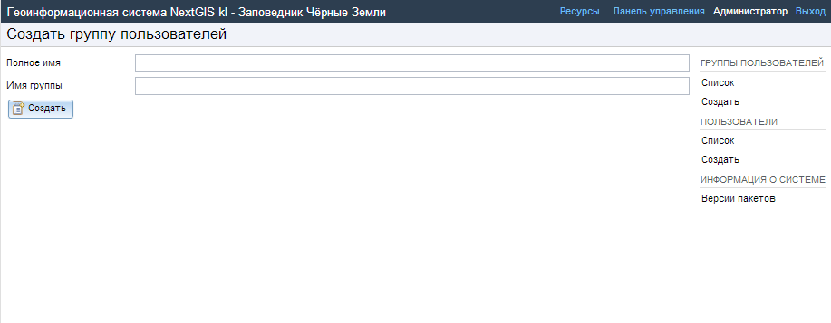
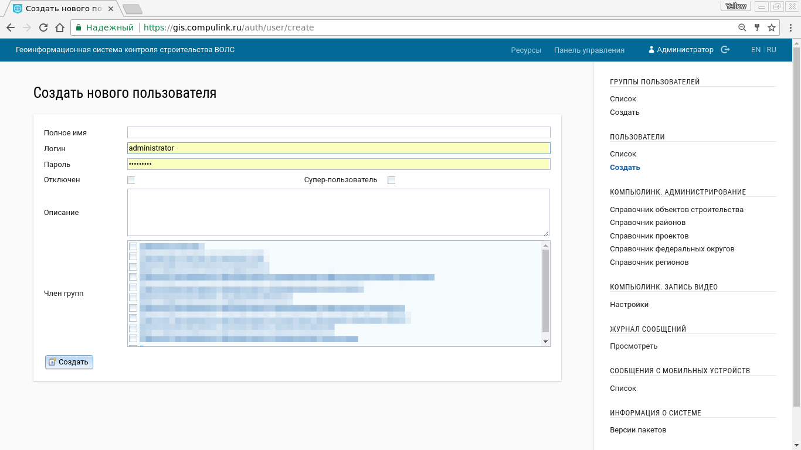
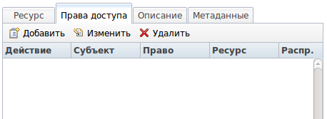
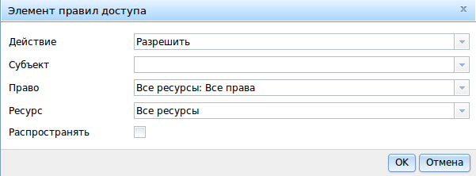
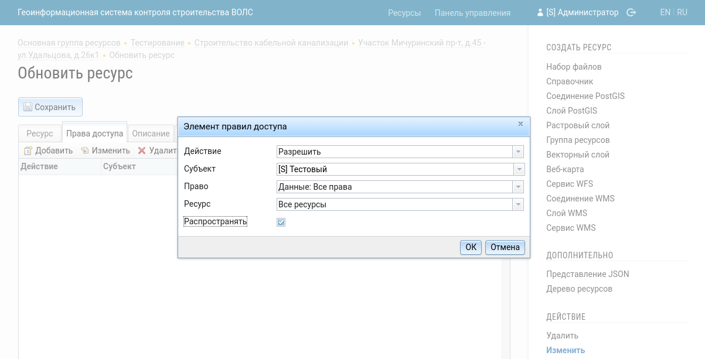
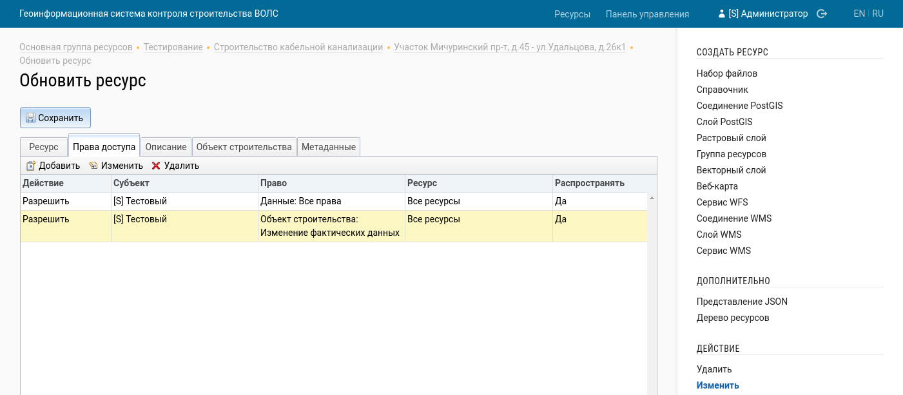

.. sectionauthor:: Артём Светлов <artem.svetlov@nextgis.ru>
.. sectionauthor:: Дмитрий Барышников <dmitry.baryshnikov@nextgis.ru>

.. _ngw_admin_tasks:

Административные задачи
=======================

.. _ngw_create_group:

Создание групп пользователей
----------------------------

Диалог создания новой группы представлен на :numref:`ngweb_admin_controlpanel_usergroup_create_pic`. 
Для открытия этого окна необходимо открыть панель управления 
(см. :numref:`admin_control_panel`) и выбрать там: 
:menuselection:`Группы пользователей --> Создать`.

   Окно создания новой группы.

В диалоге необходимо указать полное и краткое наименование группы и нажать 
кнопку :guilabel:`Создать`. Полное наименование служит в качестве описания. 

.. note:: 
   Название группы должно содержать только цифры и буквы. 

Тут же можно выбрать тех пользователей, которые входят в состав данной группы.

Создание пользователя
---------------------

Диалог создания нового пользователя представлен на :numref:`admin_controlpanel_user_create`. 
Для открытия этого окна необходимо открыть панель управления 
(см. :numref:`admin_control_panel`) и выбрать там: 
:menuselection:`Пользователи --> Создать`.

В диалоге необходимо указать:

* Полное имя пользователя (например, Иванов Иван Иванович)
* Имя пользователя – логин (например, ivanov)
* Пароль для входа

Выбрать, к какой группе относится пользователь – в списке будут отображены 
имеющиеся группы. Если необходимой группы в списке нет, то ее необходимо создать 
(см. :ref:`ngw_create_group`).

Далее необходимо нажать кнопку :guilabel:`Создать`.

   Окно создания пользователя.

.. _ngw_access_rights:
    
Настройка прав доступа
----------------------

NextGIS Web строится на ресурсном подходе - каждый компонент системы (слой, 
группа, сервис) является ресурсом. NextGIS Web обладает расширенными настройками 
прав доступа к ресурсам.

Права доступа можно назначить как при создании ресурса (см. :ref:`ngw_create_layers`), 
так и при его изменении (см. :ref:`ngw_change_layers`). Для этого в диалоге 
создания/изменения ресурс необходимо перейти на вкладку 
"Права доступа" (см. :numref:`ngweb_access_rights_tab`).

   
   Вкладка настроек прав доступа.

В данной вкладке можно назначать, отменять или изменять права доступа. Для одного
ресурса могут быть назначены различные права доступа пользователей и/или групп.
Диалог настроек правил доступа представлен на рис. :numref:`ngweb_access_rights_dialog`.

   
   Диалог настроек правил доступа.

Диалог включает в себя следующие элементы:
    
* Действие
* Субъект
* Право
* Ресурс
* Распространять

**Действие** определяет типы правила - запрещающее или разрешающее.

.. note:: По-умолчанию все запрещено.

**Субъект** - пользователь или группа, на которых распространяется правило.

**Право** - определяет разрешенные или запрещенные действия с ресурсом. Состав и описание прав представлены ниже по тексту.

**Ресурс** - на какие ресурсы распространять. Это актуально для группы ресурсов, 
где необходимо назначить права определенным типам ресурсов. Если нет необходимости 
в выборе типов ресурсов или все ресурсы в группе одинаковые, то ставиться "Все 
ресурсы".

Чекбокс "**Распространять**" определяет, распространять ли правило на ресурсы в 
подгруппы или нет.

Права могут назначаться ресурсам, даже которым не соответствуют явно, например,
право "Веб-карта: Просмотр" может быть назначено группе ресурсов, и, если включен
переключатель "Распространять", то право будет распространяться на все веб-карты
в данной группе и всех подгруппах.

Стандартные типы прав
---------------------

Группа прав "Ресурс"
~~~~~~~~~~~~~~~~~~~~

Отвечает за низкоуровневые права, которые разрешают или ограничивают
возможности работы с общими настройками ресурсов (без привязки к типу ресурса),
такими как "Наименование", "Ключ", "Родитель", "Описание".
Запрещая или разрешая какие-либо действия нужно понимать, что настройки распространяются на все типы ресурсов.
Например, запретив доступ на чтение для ресурса с ним нельзя будет производить никакие действия,
так как чтение базовых настроек запрещены.

.. note::
   Как правило, для упрощения управления правами, базовое право **Ресурс: Чтение** выдается
   всем пользователям **Прошедшим проверку** на корневой ресурс с распространением на все дочерние ресурсы.
   Это позволяет не выдавать дополнительно каждому пользователю это право явно.

**Все ресурсы: Все права** - разрешает или запрещает любые действия с любыми типами ресурсами.

**Ресурс: Все права** - разрешает или запрещает любые действия с ресурсами, за
исключением групп ресурсов.

**Ресурс: Управление дочерними ресурсами** - разрешает или запрещает изменение 
настроек дочерних ресурсов. 
 
**Ресурс: Управление правами доступа** - разрешает или запрещает управлять правами
доступа к ресурсу.

**Ресурс: Чтение** - разрешает или запрещает чтение ресурсов.

**Ресурс: Создание** - разрешает или запрещает создание ресурсов.

**Ресурс: Изменение** - разрешает или запрещает модифицировать ресурсы.

**Ресурс: Удаление** - разрешает или запрещает удалять ресурсы.

Группа прав "Метаданные"
~~~~~~~~~~~~~~~~~~~~~~~~

Отвечает за управление правами, позволяющими или запрещающими работать с метаданными ресурса.
Метаданные ресурса - особые данные, прикрепленные к каждому ресурсы, описывающие его нестандартные характеристики и свойства.
Их просмотр и редактирование возможно на вкладке **Метаданные** при открытии окна редактирования ресурса.

**Метаданные: Все права** - разрешает или запрещает любые действия над
метаданными.

**Метаданные: Запись** - разрешает или запрещает модифицировать метаданные.

**Метаданные: Чтение** - разрешает или запрещает читать метаданные.

.. note::
   Данная группа прав не используется в явном виде в Компьюлинк Мониторинг Строительства.

Группа прав "Структура данных"
~~~~~~~~~~~~~~~~~~~~~~~~~~~~~~

Отвечает за управление правами, позволяющими или запрещающими работать со структурой данных векторных слоев - чтение и изменение полей, их типов и тд.

.. note::
   Как правило, для упрощения управления правами, базовое право **Структура данных: Чтение** выдается
   всем пользователям **Прошедшим проверку** на корневой ресурс с распространением на все дочерние ресурсы.
   Это позволяет не выдавать дополнительно каждому пользователю это право явно.

**Структура данных: Все права** - разрешает или запрещает любые действия со
структурой данных.

**Структура данных: Запись** - разрешает или запрещает изменять структуру данных.

**Структура данных: Чтение** - разрешает или запрещает чтение структуры данных.

.. note::
   Данная группа прав не используется в явном виде в Компьюлинк Мониторинг Строительства.

Группа прав "Соединение"
~~~~~~~~~~~~~~~~~~~~~~~~

Отвечает за управление правами, позволяющими или запрещающими работать с соединениями к внешним БД.

**Соединение: Все права** - разрешает или запрещает любые действия с соединениями.

**Соединение: Запись параметров соединения** - разрешает или запрещает 
модифицировать соединения.

**Соединение: Чтение параметров соединения** - разрешает или запрещает чтение 
параметров соединения.

**Соединение: Использование соединения** - разрешает или запрещает использовать 
соединение (будут ли доступны пользователю слои или данные из соединения).

.. note::
   Данная группа прав не используется в явном виде в Компьюлинк Мониторинг Строительства.

Группа прав "Сервис"
~~~~~~~~~~~~~~~~~~~~

Отвечает за управление правами, позволяющими или запрещающими работать с сервисами, такими как WMS и WFS.

**Сервис: Все права** - разрешает или запрещает любые действия с сервисом.

**Сервис: Подключение** - разрешает или запрещает выполнять подключения к сервису.

**Сервис: Настройка** - разрешает или запрещает изменять настройки сервиса.

.. note::
   Данная группа прав используется в Компьюлинк Мониторинг Строительства для регулирования возможности
   подключения к сервисам редактирования по протоколу WFS.
   На уровне корневого ресурса группе **Редактирование проектных данных** для всех ресурсов типа **Сервис WFS** выданно разрешающее право.

Группа прав "Веб-карта"
~~~~~~~~~~~~~~~~~~~~~~~
Отвечает за управление правами, позволяющими или запрещающими работать с ресурсами типа **Веб-карта**.

**Веб-карта: Все права** - разрешает или запрещает любые действия над веб-картой.

**Веб-карта: Просмотр** - разрешает или запрещает просмотр веб-карты.

.. note::
   Данная группа прав не используется в явном виде в Компьюлинк Мониторинг Строительства.

Группа прав "Данные"
~~~~~~~~~~~~~~~~~~~~
Отвечает за управление правами, позволяющими или запрещающими работать с данными, хранящямися внутри слоев данных
- читать и модифицировать записи внутри векторных слоев.

**Данные: Все права** - разрешает или запрещает любые действия над данными.

**Данные: Запись** - разрешает или запрещает модификацию данных.

**Данные: Чтение** - разрешает или запрещает чтение данных.

.. note::
   Данная группа прав активно используется в Компьюлинк Мониторинг Строительства как при работе мобильных клиентов так и при работе веб-клиентов.

Специфичные права для системы Компьюлинк Мониторинг Строительства
-----------------------------------------------------------------
Система имеет специфичные ресурсы у которых есть дополнительные права, перечисленные ниже:

**Объект строительства: Все права** - разрешает или запрещает все действия с объектом строительства, описанные ниже.

**Объект строительства: Просмотр принятых участков** - разрешает или запрещает просматривать принятые участки для конкретного объекта строительства. Данное право не отменяет обязательность наличия стандартного права **Данные: Чтение**.

**Объект строительства: Редактирование принятых участков** - разрешает или запрещает создавать, удалять и редактировать принятые участки для конкретного объекта строительства.  Данное право не отменяет обязательность наличия стандартного права **Данные: Запись**.

**Объект строительства: Изменение фактических данных** - разрешает или запрещает редактировать слои с фактическими данными.  Данное право не отменяет обязательность наличия стандартного права **Данные: Запись**.

**Объект строительства: Изменение свойств** - разрешает или запрещает пользователю изменять информацию о конкретном объекте строительстве.

**Объект строительства: Утверждение отклонений от проекта** - разрешает или запрещает пользователю работать с отклонениями для данного объекта строительства.  Данное право не отменяет обязательность наличия стандартного права **Данные: Запись**.

Так же важно помнить, что многие функции системы ориентируются на стандартное право **Данные: Запись** присвоенное пользователю\\группе для конкретного объекта строительства.

Это право проверяется основной страницей с веб-картой при формировании дерева проектов\\объектов строительства.
Так же данное право проверяется во всех фильтрах в отчетных формах.
Аналогичная проверка осуществляется при выдаче списка доступных объектов строительства мобильному приложению.
Пользователи не имеющие данного права, не смогут изменять **Фактические данные**, а так же модифицировать **Принятые участки**.

Примеры настроек прав доступа
-----------------------------

Дать пользователю права на работу с объектом строительства через мобильное приложение
~~~~~~~~~~~~~~~~~~~~~~~~~~~~~~~~~~~~~~~~~~~~~~~~~~~~~~~~~~~~~~~~~~~~~~~~~~~~~~~~~~~~~

Необходимо открыть страницу редактирования **Объекта строительства** и во вкладке **Права доступа** добавить соответствующему пользователю
разрешающее право "Данные:Все права" на все типы ресурсов с распространением на все дочерние.

   Задать в свойствах **Объекта строительства**

Дать пользователю права на работу с объектом строительства через веб-клиент
~~~~~~~~~~~~~~~~~~~~~~~~~~~~~~~~~~~~~~~~~~~~~~~~~~~~~~~~~~~~~~~~~~~~~~~~~~~

Необходимо открыть страницу редактирования **Объекта строительства** и во вкладке **Права доступа** добавить соответствующему пользователю
разрешающее право "Данные:Все права" на все типы ресурсов с распространением на все дочерние.

   Задать в свойствах **Объекта строительства**

Дать пользователю права на редактирование проектных данных объекта строительства
~~~~~~~~~~~~~~~~~~~~~~~~~~~~~~~~~~~~~~~~~~~~~~~~~~~~~~~~~~~~~~~~~~~~~~~~~~~~~~~~
* Необходимо добавить пользователя в группу **Редактирование проектных данных**
* Необходимо открыть страницу редактирования **Объекта строительства** и во вкладке **Права доступа** добавить соответствующему пользователю разрешающее право "Данные:Все права" на все типы ресурсов с распространением на все дочерние.

   Задать в свойствах **Объекта строительства**

Дать пользователю права на редактирование проектных данных объекта строительства
~~~~~~~~~~~~~~~~~~~~~~~~~~~~~~~~~~~~~~~~~~~~~~~~~~~~~~~~~~~~~~~~~~~~~~~~~~~~~~~~

Необходимо открыть страницу редактирования **Объекта строительства** и во вкладке **Права доступа** добавить соответствующему пользователю
разрешающее право **Данные:Все права** и **Объект строительства: Изменение фактических данных** на все типы ресурсов с распространением на все дочерние.

   Задать в свойствах **Объекта строительства**

.. _ngw_change_password:

Изменение пароля пользователя
-----------------------------

Для смены пароля пользователя можно воспользоваться веб интерфейсом.
Также существует возможность изменить пароль пользователя из командной
строки:

.. note:: Указание нового пароля пользователя в командной строке потенциально не безопасно.

.. code:: bash

  env/bin/nextgisweb --config config.ini change_password user password
  env/bin/nextgisweb --config config.ini change_password user password
