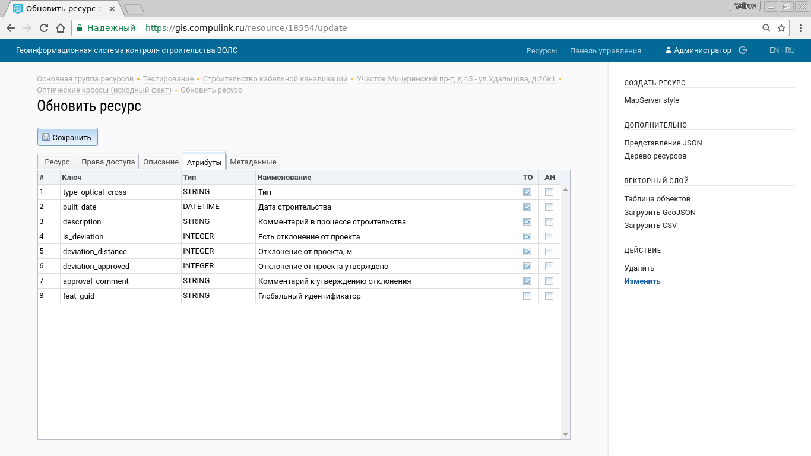

.. sectionauthor:: Артём Светлов <artem.svetlov@nextgis.ru>

.. _ngw_change_layers:

Настройки слоёв
===============

Введение
--------

Для редактирования слоя необходимо зайти в его описание и в блоке :guilabel:`Операции` выбрать :guilabel:`Редактирование`. При этом откроется окно редактирования свойств
этого слоя. Кроме того, редактирование можно запустить в таблице слоев группы из колонки :guilabel:`Операции`.

.. _ngw_attributes:

Атрибуты слоя
-------------

Дополнительно к параметрам, которые вводились при создании слоя, в окне присутствует вкладка :guilabel:`Атрибуты` (см. :numref:`admin_layers_attr`)

   Окно редактирования слоя, вкладка :guilabel:`Атрибуты`.

В этой таблице перечислены атрибуты слоя.

* Галочка в столбце :guilabel:`ТО` обозначает, что атрибут выводится в окне идентификации.
* Галочка в столбце :guilabel:`АН` обозначает, что из этого атрибута берётся название при идентификации, а также при формировании списка закладок. 

Для каждого имени поля можно поставить соответствующий псевдоним для отображения 
вместо имени поля в окне идентификации.

.. _ngw_attributes_edit:

Редактирование свойств атрибутов
--------------------------------

Программное обеспечение NextGIS Web позволяет редактировать атрибуты географических 
объектов. Редактирование атрибутов можно вызывать из административного интерфейса
и из просмотра карты. 

* Редактирование атрибутов из админки: откройте векторный слой, нажмите в правом 
  меню :guilabel:`Таблица объектов`. Откроется таблица. Щёлкните на круглую 
  кнопку в левом конце строки, затем кнопку :guilabel:`Изменить`.
* Редактирование атрибутов при просмотре карты: щёлкните инструментом 
  идентификации по объекту, нажмите на кнопку редактирования.

В открывшемся окне можно изменять значения атрибутов. 
Описание, заданное на вкладке "Описание", будет видно при просмотре карты в окне идентификации. 

При редактировании слоя из PostGIS изменения атрибутов сохраняются в PostGIS, а 
описания - в локальной базе. 
При редактировании слоя из Shapefile изменения атрибутов и описания сохраняются 
в локальной базе. 

Геоданные с изменёнными атрибутами можно выгрузить по ссылке  :guilabel:`Загрузить GeoJSON` или раздав слой по протоколу WFS. Функционала выгрузки описаний сейчас 
нет.
