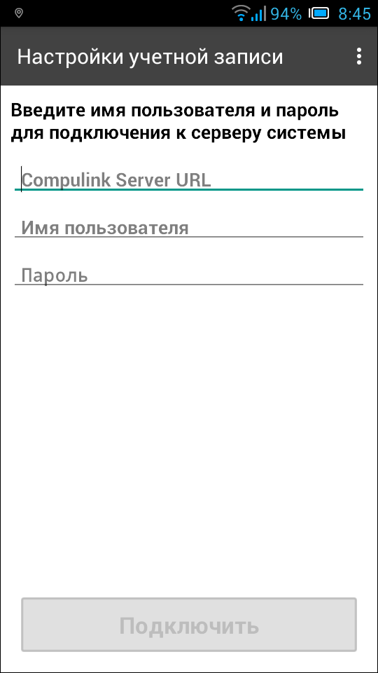

.. sectionauthor:: Александр Мурый <amuriy@gmail.com>

.. _compulink_mobile_install:

Установка и запуск
==================

Приложение может быть установлено на поддерживаемое устройство через официальный магазин приложений (`Google Play <https://play.google.com/store/apps/details?id=com.nextgis.ngm_clink_monitoring>`_).

Для установки из магазина приложений необходимо запустить стандартное приложение *Google Play* 
и в строке поиска ввести "Compulink". Далее среди появившихся результатов поиска нужно выбрать "Мониторинг строительства" и установить приложение на устройство.

Для запуска программы используется ярлык, автоматически создаваемый при её 
установке (:numref:`installed_shortcut_pic`). 

   Ярлык приложения в интерфейсе ОС Android.

При первом запуске приложения появляется первоначальное окно с настройками учетной записи, через которую происходит подключение к базе данных строящихся ВОЛС. Если при этом на устройстве отключен датчик GPS, пользователь видит предупреждение "GPS отключен. Для корректной работы приложения включите GPS!" (:numref:`gps_error`).

   Предупреждение об отключенном GPS-датчике 

   
После нажатия кнопки ОК появится окно со стандартными системными настройками "Мое местоположение", где нужно активировать пункт "По спутникам GPS" (:numref:`gps_settings`).

.. figure:: _static/gps_settings.png
   :name: gps_settings
   :align: center
   :height: 10cm

   Настройки местоположения

После включения GPS-датчика переход назад возвращает пользователя к окну настроек учетной записи (:numref:`account_settings`). 

   
   Настройки учетной записи

Здесь в соответствующих полях необходимо ввести полный URL (ссылку) действующего сервера системы (включая "http://" или "https://" в начале), имя пользователя и пароль. После заполнения всех полей нужно нажать кнопку "Подключить" (:numref:`account_connect`).

   
   Подключение к серверу данных
   
   
Схема дальнейшей работы приложения простая:

Выбор участка работ  ==>  Выбор вида работ
   
   
   
   
   
   

