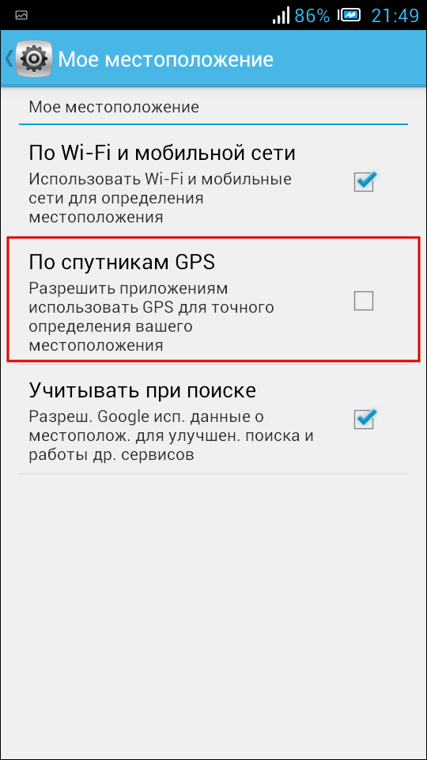

.. sectionauthor:: Дмитрий Барышников <dmitry.baryshnikov@nextgis.ru>

.. _ngmobile_install:

Установка и запуск
==================

Приложение может быть установлено на поддерживаемое устройство через официальный магазин приложений (`Google Play <https://play.google.com/store/apps/details?id=com.nextgis.ngm_clink_monitoring>`_).

Для установки из магазина приложений необходимо запустить стандартное приложение *Google Play* 
и в строке поиска ввести "Compulink". Далее среди появившихся результатов поиска нужно выбрать "Мониторинг строительства" и установить приложение на устройство.

Для запуска программы используется ярлык, автоматически создаваемый при её 
установке (:numref:`installed_shortcut_pic`). 

.. figure:: _static/installed.png
   :name: installed_shortcut_pic
   :align: center
   :height: 10cm

   Ярлык приложения в интерфейсе ОС Android.
   
Если при запуске приложения на устройстве отключен датчик GPS, появляется предупреждение "GPS отключен. Для корректной работы приложения включите GPS!" (:numref:`gps_error_shortcut_pic`).

.. figure:: _static/gps_error.png
   :name: gps_error_shortcut_pic
   :align: center
   :height: 10cm

   Предупреждение при отключенном GPS-датчике 

После нажатия кнопки ОК появится окно со стандартными системными настройками "Мое местоположение", где нужно активировать пункт "По спутникам GPS" (:numref:`gps_settings_shortcut_pic`).

   Настройки местоположения
			
Переход назад автоматически возвращает пользователя в главное окно приложения.

