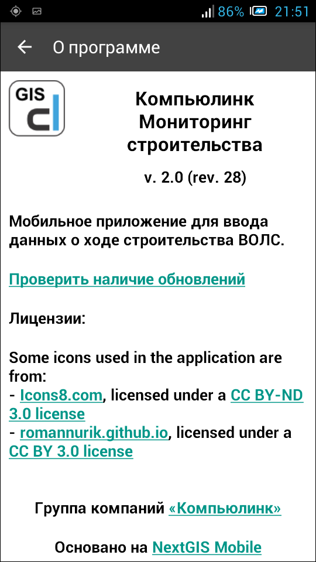

.. sectionauthor:: Дмитрий Барышников <dmitry.baryshnikov@nextgis.ru>

.. _ngmobile_intro:

Введение
========

.. _ngmobile_purpose:

Назначение программы 
--------------------

Приложение **Компьюлинк Мониторинг строительства** является компонентом автоматизированной системы контроля строительства волоконно-оптических линий связи (ВОЛС) компании Компьюлинк. Это мобильная ГИС (:term:`геоинформационная система`) для операционной системы :term:`Android`, построенная на основе NextGIS Mobile (:numref:`about_shortcut_pic`).

Мобильное приложение для ввода данных о ходе строительства ВОЛС предназначено для ввода данных о построенных участках ВОЛС и фиксации координат мест фактического расположения ее элементов (трассы оптического кабеля, муфт, кроссов, ГНБ переходов и т.п.). 

Приложение позволяет:

* получать данные о строящихся ВОЛС с сервера системы;
* снимать координаты точек на местности, в которых проложен кабель, установлены оптические муфты, а также оптические кроссы;
* снимать координаты точек входа и выхода ГНБ переходов;
* снимать координаты установки опор точек доступа;
* делать фотографии, подтверждающие факт и качество выполнения работ;
* автоматически передавать собранные данные на сервер системы.
* отображать на карте объекты размещения ВОЛС, а также объектов строящихся ВОЛС (строительные длины оптического кабеля, муфты, кроссы и т.д.);

Некоторые иконки, использованные в приложении, получены с сайтов:

* `Icons8.com <http://icons8.com/android-icons>`_ распространяются по `CC BY-ND 3.0 <http://creativecommons.org/licenses/by-nd/3.0/>`_;
* `romannurik.github.io <http://romannurik.github.io/AndroidAssetStudio/icons-launcher.html>`_ - `CC BY 3.0 <http://creativecommons.org/licenses/by/3.0/>`_.

.. only:: latex

   Данная документация распространяется по лицензии Creative Commons 
   **"Attribution-NoDerivs" ("Атрибуция — Без производных произведений") СC BY-ND**
   
   .. image:: _static/cc_by.png  

Документация описывает Компьюлинк Мониторинг строительства версии 2.0 (rev. 28)

 
.. _ngmobile_launch_conditions:

Условия работы приложения
----------------------------

Для работы приложения необходимо устройство (смартфон, планшет и т.п.) под 
управлением операционной системы :term:`Android` версии **2.2** и выше. Желательно, 
чтобы устройство было оснащено следующим оборудованием:

* датчик :term:`GPS` и/или :term:`ГЛОНАСС`;
* цифровой компас;
* модуль сотовой связи;
* тыловая фотокамера. 

.. note::

   Если какое-либо оборудование из перечисленного отсутствует в устройстве, то связанные с данным оборудованием функции будут недоступны.

Приложение не предъявляет специфических системных требований.
