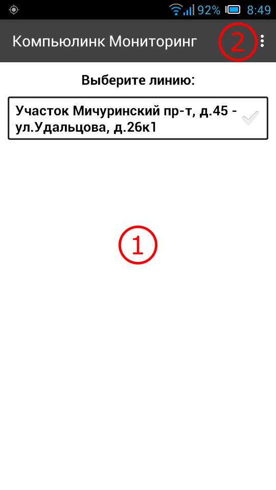
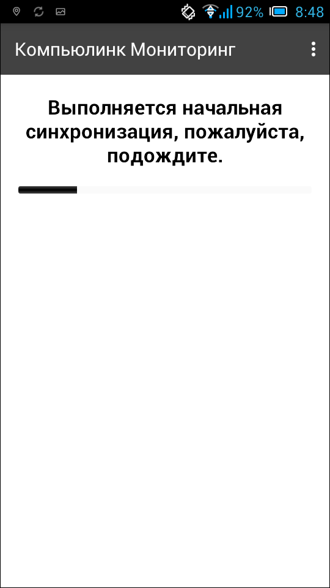

.. sectionauthor:: Александр Мурый <amuriy@gmail.com>

.. _compulink_mobile_main_window:

Главное окно приложения
==========================

После первоначального подключения учетной записи к серверу системы появляется главное окно приложения (:numref:`main_window_pic`).

   
   Главное окно приложения.
   
   Цифрами обозначено: 1 - список участков работ; 2 - главное меню.

Основным компонентом окна является список участков работ, доступных данному пользователю (под заголовком "Выберите линию"). Список участков работ (линий) формируется в веб-приложении администратором ресурсов, каждому аккаунту соответствует свой набор участков. В связи с этим окно может оказаться, например, пустым.  

Главное меню приложения "сквозного" типа, т.е. доступно всегда, на любом этапе работы. Меню содержит пункты:

* Карта
* Синхронизация
* Настройки
* О программе

Пункты меню могут незначительно меняться в зависимости от этапа работы. Эти изменения будут описаны далее в документации.

После выбора конкретного участка работ выполняется начальная синхронизация (:numref:`start_sync`)

   
   Начальная синхронизация приложения.

