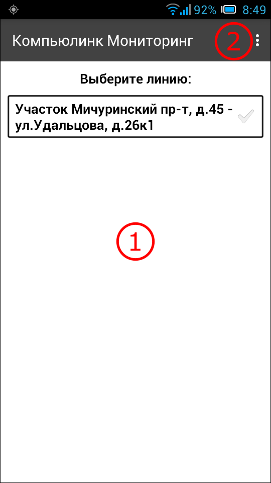
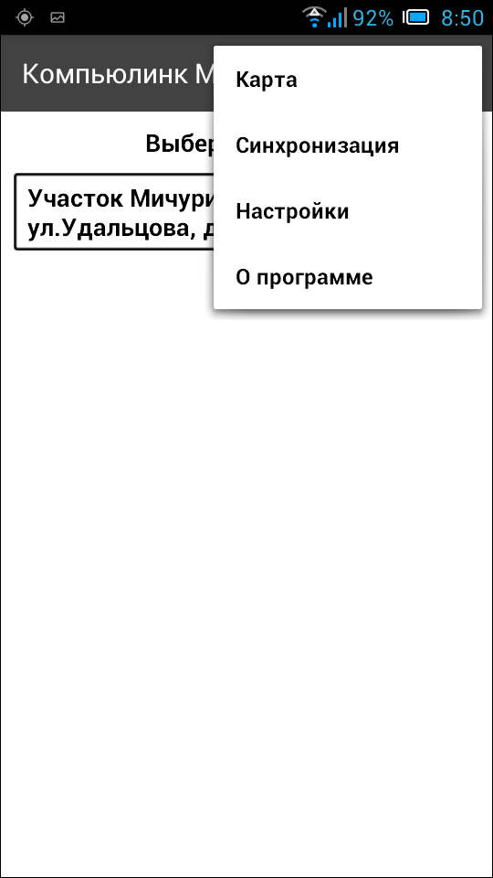
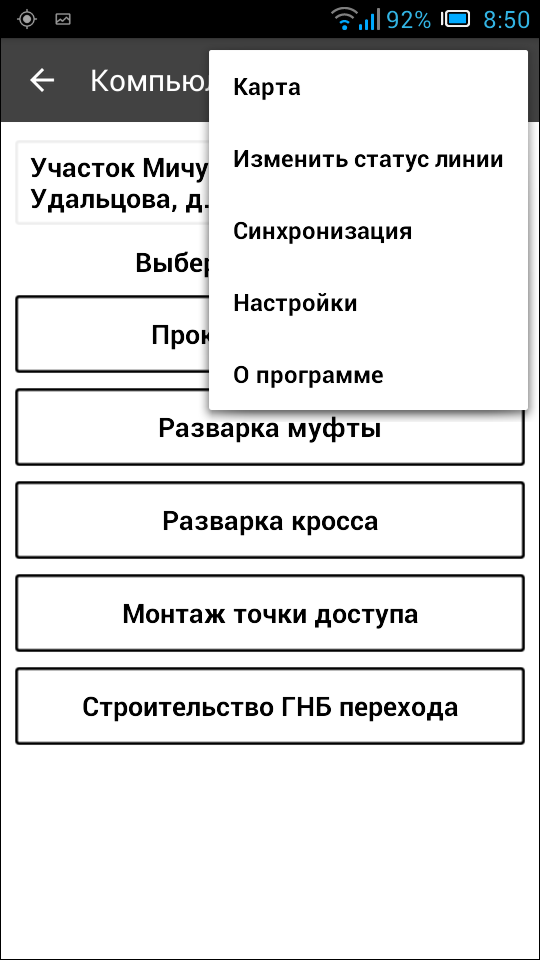

.. sectionauthor:: Александр Мурый <amuriy@gmail.com>

.. _compulink_mobile_main_window:

Главный экран приложения и основное меню
=========================================

Главный экран приложения
-------------------------

После первоначального подключения учетной записи к серверу системы появляется главный экран приложения (:numref:`main_window_pic`).

   
   Главный экран приложения.
   
   Цифрами обозначены: 1 - список участков работ; 2 - главное меню.

Основным компонентом окна является список участков работ, доступных данному пользователю (под заголовком "Выберите линию"). Список участков работ (линий) формируется в веб-приложении администратором ресурсов, каждому аккаунту соответствует свой набор участков. В связи с этим окно может оказаться, например, пустым.  

После выбора конкретного участка работ выполняется начальная синхронизация (:numref:`start_sync`)

   
   Начальная синхронизация приложения.

Основное меню приложения
------------------------------

Главное меню приложения (:numref:`main_menu`) "сквозного" типа, т.е. доступно не только на главном экране, но и из других разделов интерфейса, т.е. на любом этапе работы. Меню содержит следуюшие пункты:

* Карта
* Синхронизация
* Настройки
* О программе

   Основное меню приложения

Пункты меню могут незначительно меняться в зависимости от этапа работы. Эти изменения будут описаны далее в документации. Например, 

   Основное меню приложения

   

Карта
~~~~~~

При нажатии на пункт меню "Карта" появляется окно карты (:numref:`map`), на котором отображается выбранный ранее участок работ с объектами размещения ВОЛС и трассами строящихся ВОЛС. В качестве картоосновы при отображении объектов используются данные онлайн-карты картографического сервиса OpenStreetMap. Данные строительства ВОЛС отображаются в соответствии с условными обозначениями (легендой карты), которые задаются администратором системы.

   Пункт меню "Карта"
|
|

Помимо мест расположения объектов есть возможность просмотреть значения атрибутов объектов. Делается это простым нажатием на объекты. Каждый тип объектов имеет свой набор атрибутов, заданных администратором системы (:numref:`object_attr_1`, :numref:`object_attr_2`, :numref:`object_attr_3`, :numref:`object_attr_4`).
   

.. figure:: _static/object_attr_2.png
   :name: object_attr_2
   :align: center
   :height: 10cm   

.. figure:: _static/object_attr_4.png
   :name: object_attr_4
   :align: center
   :height: 10cm   			
	  
   
Синхронизация
~~~~~~~~~~~~~~

   
   Начальная синхронизация приложения.

Приложение обеспечивает автоматический и ручной обмен данными с сервером системы.
В автоматическом режиме должны передаваться данные, собранные в режиме ввода данных о ходе выполнения работ. В ручном режиме должны передаваться данные об объектах, собранные в режиме  сбора данных.

Обмен данными между мобильным приложением и сервером системы должен осуществляться через интернет. Для передачи данных используется максимально быстрое из имеющихся в настоящий момент подключений к сети (подключение к компьютеру, WiFi-подключение, 3G-подключение и т.д.)

В автоматическом режиме обмен данными между мобильным приложением и сервером должен осуществляется сразу после запуска мобильного приложения, а также происходить в фоновом режиме через определенные интервалы времени в процессе работы приложения. В процессе обмена передаваться должны только новые или изменившиеся данные. 
В автоматическом режиме с сервера системы в мобильное приложение передается следующая информация:
- данные объектов размещения ВОЛС (из тех слоев, к которым имеет доступ пользователь) 
- данные строительных длин и муфт (координаты, атрибуты)
Из мобильного приложения на сервер системы в автоматическом режиме должна передаваться следующая информация:
- данные о ходе строительства: проложенные строительные длины, смонтированные муфты и т.д.
- фотографии, которые были сделаны из формы создания отчета о выполненных работах.
В ручном режиме из мобильного приложения на сервер системы должна быть возможность передать следующую информацию:
- снятые координаты объектов и типы соответствующих объектов
- записанные треки
- фотографии (и их координаты), которые были сделаны в режиме сбора данных

При передаче данных в ручном режиме пользователь должен иметь возможность выбрать объекты, фотографии и треки, данные по которым будут переданы на сервер системы.
Передаваемые на сервер фотографии должны быть  в формате jpg, иметь размер 448х336 точек, горизонтальное и вертикальное разрешение 72 точек на дюйм 
Программа должна обеспечивать возможность экспорта в формате GPX снятых в режиме сбора данных координат объектов, а также записанных треков.

Настройки
~~~~~~~~~~~~~~~

О программе
~~~~~~~~~~~~~~~

