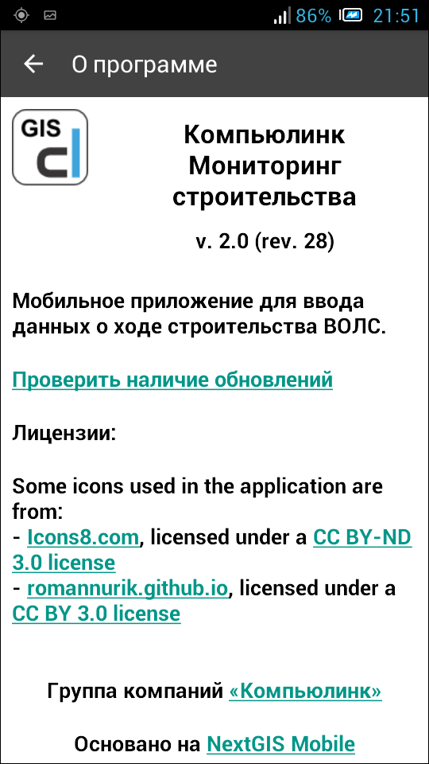

.. sectionauthor:: Александр Мурый <amuriy@gmail.com>

.. _compulink_mobile_main_window:

Главный экран приложения и основное меню
=========================================

Главный экран приложения
-------------------------

После подключения учетной записи к серверу системы появляется главный экран приложения (:numref:`main_window_pic`).

.. figure:: _static/main_window2.png
   :name: main_window_pic
   :align: center
   :height: 10cm
   
   Главный экран приложения.
   
   Цифрами обозначены: 1 - список участков работ; 2 - главное меню.

Основным компонентом окна является список участков работ, доступных данному пользователю с настоящий момент (под заголовком **"Выберите линию"**). Список линий формируется в администратором ресурсов на сервере системы, каждому аккаунту соответствует свой набор участков. В связи с этим окно может оказаться, например, пустым.  

После выбора конкретного участка работ выполняется начальная синхронизация (:numref:`start_sync`):

.. figure:: _static/start_sync.png
   :name: start_sync
   :align: center
   :height: 10cm
   
   Начальная синхронизация приложения.

Основное меню приложения
------------------------------

Меню приложения появляется при нажатии на соответствующую кнопку (три крупные точки в правом верхнем углу экрана, расположенные вертикально). Меню доступно не только на главном экране, но и в других разделах интерфейса, т.е. на любом этапе работы.

Основное меню (на главном экране) содержит следуюшие пункты (:numref:`main_menu`):

* Карта
* Синхронизация
* Настройки
* О программе

.. figure:: _static/main_menu.png
   :name: main_menu
   :align: center
   :height: 10cm

   Основное меню приложения

Пункты меню могут незначительно меняются в зависимости от текущего экрана, т.е. от этапа работы.

Например, для экрана с видами работ в меню добавлен пункт **"Изменить статус линии"** (:numref:`work_types_menu`). Подробнее об этом можно прочитать в разделе :ref:`compulink_mobile_line_status`.

.. figure:: _static/work_types_menu.png
   :name: work_types_menu
   :align: center
   :height: 10cm

   Пункт меню "Изменить статус линии"

Карта
~~~~~~

При нажатии на пункт меню "Карта" появляется окно карты (:numref:`_map`), на котором отображается выбранный ранее участок работ с объектами размещения ВОЛС и трассами строящихся ВОЛС. В качестве картоосновы при отображении объектов используются данные онлайн-карты картографического сервиса OpenStreetMap. Данные строительства ВОЛС отображаются в соответствии с условными обозначениями (легендой карты), которые задаются администратором системы.

.. figure:: _static/map.png
   :name: _map
   :align: center
   :height: 10cm

   Пункт меню "Карта"

Помимо мест расположения объектов есть возможность просмотреть значения атрибутов объектов. Делается это простым нажатием на объекты. Каждый тип объектов имеет свой набор атрибутов, заданных администратором системы (:numref:`object_attr_1`, :numref:`object_attr_2`, :numref:`object_attr_3`, :numref:`object_attr_4`).
   
.. figure:: _static/object_attr_1.png
   :name: object_attr_1
   :align: center
   :height: 10cm   

   Атрибуты объекта "Оптические муфты (исходный факт)"
			

   Атрибуты объекта "Отметки спецпереходов (исходный факт)"

.. figure:: _static/object_attr_3.png
   :name: object_attr_3
   :align: center
   :height: 10cm

   Атрибуты объекта "Строительные длины ОК (проект)"
			

   Атрибуты объекта "Оптические муфты (проект)"

.. _compulink_mobile_sync:

Синхронизация
~~~~~~~~~~~~~~

При выборе пункта меню **"Синхронизация"** появляется всплывающее окно с выбором действия (:numref:`menu_sync`):

* Отправить данные на сервер
* Получить данные с сервера
* Отправить копию всех данных

   
   Начальная синхронизация приложения.

Пункт **"Отправить данные на сервер"** подразумевает отправку на сервер основных данных (координат и параметров объектов, а также фотографий), в то время как пункт **"Отправить копию всех данных"** отвечает за полное резервное копирование данных на удаленный сервер. 

Пункт **"Получить данные с сервера"** служит для обновления данных с сервера системы, доступных для данного аккаунта.

Настройки
~~~~~~~~~~~~~~~

Подробная информация о настройках приложения в разделе :ref:`compulink_mobile_settings`.

О программе
~~~~~~~~~~~~~~~

Здесь показана общая информация о приложении (:numref:`about_shortcut_pic`): название, версия, назначение, лицензия, используемые компоненты.

   
Также здесь можно проверить наличие обновлений для приложения, нажав на соответствующую ссылку в окне.  

