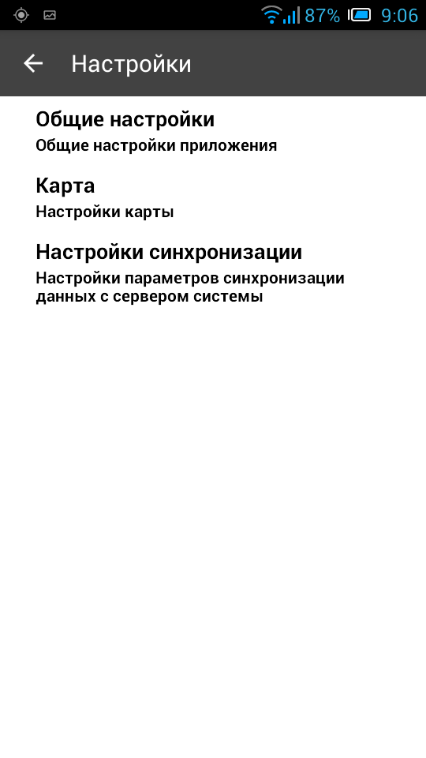
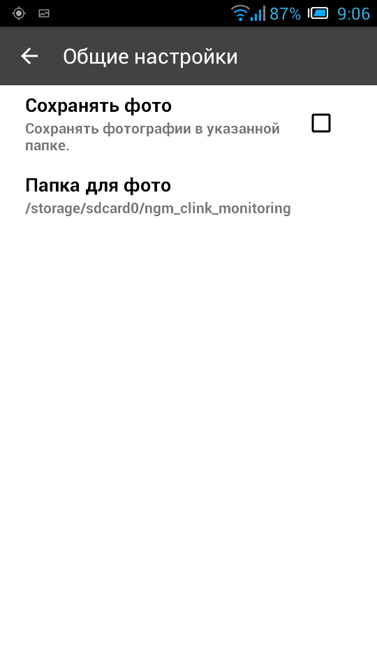
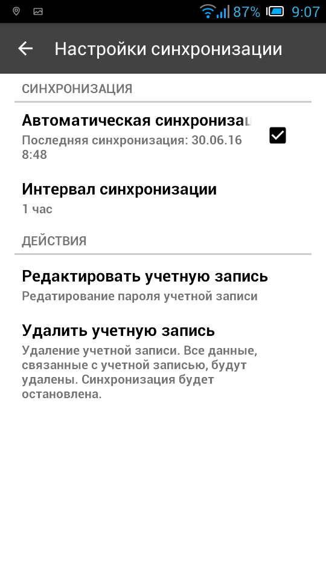

.. sectionauthor:: Александр Мурый <amuriy@gmail.com>

.. _compulink_mobile_settings:

Настройки приложения
===============

   
   Окно настроек

   
   Общие настройки приложения

.. figure:: _static/settings_map.png
   :name: settings_map
   :align: center
   :height: 10cm
   
   Настройки карты 

   
   Настройки синхронизации  
