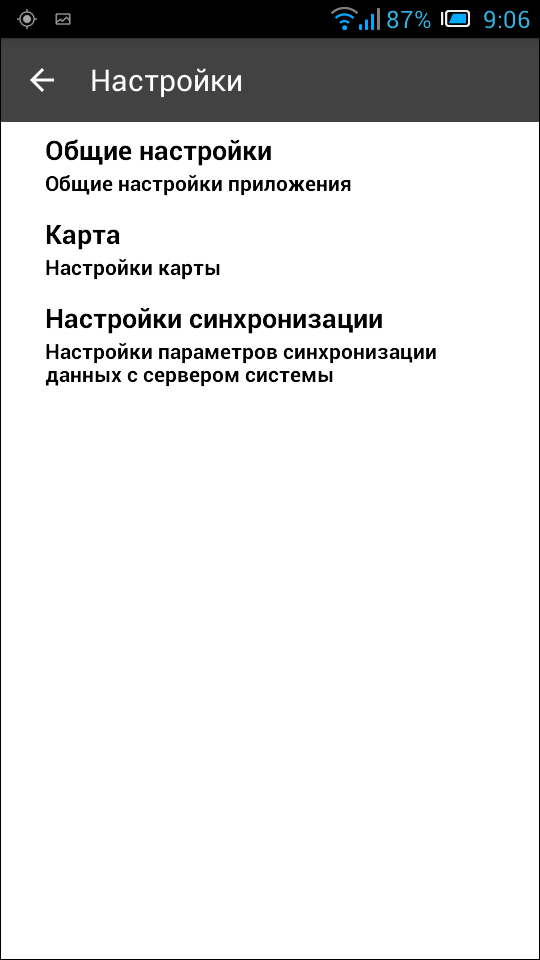
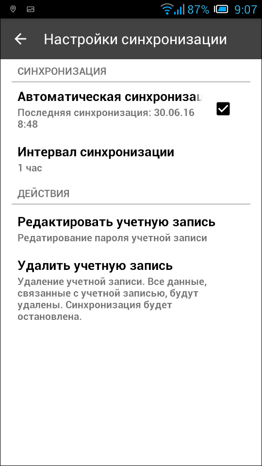

.. sectionauthor:: Александр Мурый <amuriy@gmail.com>

.. _compulink_mobile_settings:

Настройки приложения
====================

   Настройки приложения (:numref:`settings`) содержат 3 пункта:

* Общие настройки
* Карта
* Настройки синхронизации

   
   Окно настроек

Общие настройки
~~~~~~~~~~~~~~~
   
Общие настройки (:numref:`settings_common`) в текущей версии приложения касаются только сохранения фотографий и содержат 2 пункта:

* Сохранять фото
* Папка для фото

Все фотографии, сделанные в режиме сбора данных, сохраняются в директорию, путь к которой указывается в настройках. Как видно на :numref:`settings_common`, по умолчанию фотографии сохраняются в папку */storage/sdcard0/ngm_clink_monitoring*, расположенную на съемной флеш-карте (SD).

.. figure:: _static/settings_common.png
   :name: settings_common
   :align: center
   :height: 10cm
   
   Общие настройки приложения (путь сохранения фотографий)

При необходимости путь сохранения фотографий может быть изменен. Для этого нужно поставить галочку **"Сохранять фото"**, после чего параметр **Папка для фото** станет редактируемым, и можно будет выбрать произвольный путь для сохранения фотографий на устройстве (:numref:`settings_common1`).

   
   Общие настройки приложения (путь сохранения фотографий)

Внутри данной папки фотографии сохраняются по подпапкам, название которых соответствует дате, когда была сделана фотография. Для каждой фотографии будут сохранены координаты места, в котором была сделана данная фотография.
   

Карта
~~~~~
   
Настройки карты (:numref:`settings_map`) содержат три пункта:

* Не отключать экран
* Кнопки масштабирования
* Текущее местоположение
   

.. figure:: _static/settings_map.png
   :name: settings_map
   :align: center
   :height: 10cm
   
   Настройки карты 

Параметр **Не отключать экран** (выключен по умолчанию) служит для предотвращения отключения экрана при показе карты, что может мешать проведению работ. Активизация пераметра позволяет держать экран устройства включенным вне зависимости от системных настроек Android. 

Параметр **Кнопки масштабирования** (выключен по умолчанию) позволяет добавлять в окно карты кнопки изменения (увеличения и уменьшения) масштаба карты. Это может пригодиться пльзователя в некоторых ситуациях, когда изменять масштаб традиционным путем (сведением и разведением двух пальцев) неудобно.

Параметр **Текущее местоположение** (включен по умолчанию) служит для отображения текущего местоположения пользователя на карте (будет отмечено особым знаком, отличающимся от других условных обозначений для сетей ВОЛС).
   

.. _compulink_mobile_settings_sync:

Настройки синхронизации
~~~~~~~~~~~~~~~~~~~~~~~
Пункт **Настройки синхронизации** (:numref:`settings_sync`) разделен на две группы настроек:

* Синхронизация
* Действия

   
   Настройки синхронизации  

Пункт **"Синхронизация"** содержит переключатель автоматической синхронизации (включена по умолчанию) и настраиваемый интервал синхронизации (по умолчанию 1 час), см. :numref:`settings_sync2`.

Под первым параметром указана дата и время последней синхронизации. При нажатии на переключатель немедленно происходит синхронизация приложения (это можно увидеть по всплывающему уведомлению в системе *"Синхронизация начата"*).

   
   Выбор интервала синхронизации  

Подробнее о синхронизации в приложении можно прочитать здесь: :ref:`compulink_mobile_sync`.

Пункт **"Действия"** отвечает за редактирование и удаление учетной записи.

В настройках учетной записи можно сменить новый логин и пароль для подключения к серверу системы (:numref:`settings_sync3`.)

   Редактирование учетной записи

С пунктом **"Удаление учетной записи"** (:numref:`settings_sync4`) следует быть особенно осторожным, т.к. в результате удаления учетной записи удалятся и все данные, связанные с ней, а также будет остановлена синхронизация.
   

   
   Удаление учетной записи

