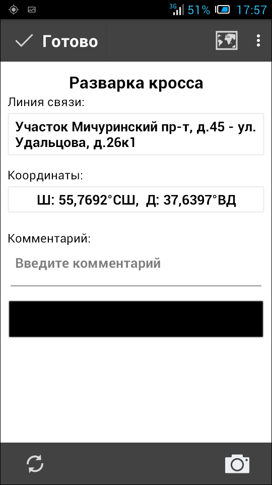

.. sectionauthor:: Александр Мурый <amuriy@gmail.com>

.. _compulink_mobile_works_window:

Экран для выбора вида работ
============================

Главный экран приложения после завершения начальной синхронизации пользователю сменяется на экран, на котором нужно выбрать вид работ (список стандартизирован) (:numref:`work_types`):

* Прокладка кабеля  
* Разварка муфты
* Разварка кросса
* Монтаж точки доступа
* Строительство ГНБ перехода 

   
   Вид работ

Дальнейшая работа приложения зависит от выбранного вида работ.

.. _compulink_mobile_works:
   

Виды работ
====================

Виды работ
--------------------

Основное смысловое содержание приложения составляют виды работ:

* Прокладка кабеля
* Разварка муфты 
* Разварка кросса
* Монтаж точки доступа
* Строительство ГНБ перехода

При выборе определенного вида работ появится соответствующий экран с параметрами вида работ. После выбора и заполнения всех нужных пунктов пользователь должен нажать кнопку "**Готото**" для сохранения объекта.

Если пользователь по тем или иным причинам захочет отменить добавление нового объекта, на экране появится предупреждение (:numref:`cancel_confirm`):

   Отмена ввода данных

Прокладка кабеля
~~~~~~~~~~~~~~~~~~~~

Вид работ "Прокладка кабеля" (:numref:`cabel`) имеет один задаваемый параметр - "Способ прокладки" (:numref:`cabel_method`), а также стандартный набор инструментов (комментарий, фотографии). 

.. figure:: _static/cabel.png
   :name: cabel
   :align: center
   :height: 10cm

   Прокладка кабеля.

.. figure:: _static/cabel_method.png
   :name: cabel_method
   :align: center
   :height: 10cm

   Выбор способа прокладки

При фиксации координат точек прокладки кабеля приложение проверяет расстояние до ближайшей ранее сохраненной точки и не позволяет осуществлять ввод, если расстояние превышает установленное пороговое значение (по умолчанию 300 метров). В данном случае на экране появляется предупреждение о превышении расстояния от ближайшей точки (:numref:`distance_warning`).

   Предупреждение о превышении расстояния от ближайшей точки

В случае, если это оправдано рабочей ситуацией, пользователь может задать новую начальную точку трассы ВОЛС (кнопка **Начальная точка** под предупреждением). Приложение запросит подтверждение создания новой начальной точки. (:numref:`new_startpoint_confirm`).

   

   Подтверждение создания новой начальной точки

Разварка муфты
~~~~~~~~~~~~~~~~~~~~

Вид работ "Разварка муфты" (:numref:`razvarka_mufty_0`) имеет два задаваемых параметра: "Тип муфты" и "Место размещения муфты", а также стандартный набор инструментов (комментарий, фотографии).

.. figure:: _static/razvarka_mufty_0.png
   :name: razvarka_mufty_0
   :align: center
   :height: 10cm

   Разварка муфты

   Выбор типа муфты

(:numref:`razvarka_mufty_2`)

.. figure:: _static/razvarka_mufty_2.png
   :name: razvarka_mufty_2
   :align: center
   :height: 10cm

   Выбор места размещения муфты

   
Разварка кросса
~~~~~~~~~~~~~~~~~~~~

Вид работ "Разварка кросса" (:numref:`razvarka_krossa`) не имеет специализированных параметров, только стандартный набор инструментов (комментарий, фотографии).

   Разварка кросса

Монтаж точки доступа
~~~~~~~~~~~~~~~~~~~~~

Вид работ "Монтаж точки доступа" (:numref:`montage_point`) не имеет специализированных параметров, только стандартный набор инструментов (комментарий, фотографии).

   Монтаж точки доступа

Строительство ГНБ перехода
~~~~~~~~~~~~~~~~~~~~~~~~~~~~~~

Вид работ "Строительство ГНБ перехода" (:numref:`GNB_perehod_0`) имеет два задаваемых параметра: "Способ прокладки" (:numref:`GNB_perehod_1`) и "Точка входа/выхода" (:numref:`GNB_perehod_2`), а также стандартный набор инструментов (комментарий, фотографии).

   Строительство ГНБ перехода

.. figure:: _static/GNB_perehod_1.png
   :name: GNB_perehod_1
   :align: center
   :height: 10cm

   Способ прокладки

.. figure:: _static/GNB_perehod_2.png
   :name: GNB_perehod_2
   :align: center
   :height: 10cm

   Точка входа/выхода

Стандартные параметры и элементы интерфейса
---------------------------------------------

Необходимо отметить, что приложение имеет ряд стандартных параметров и разделов интерфейса, которые не зависят от вида работ.

Определение координат
~~~~~~~~~~~~~~~~~~~~~~

Определение координат всегда происходит в автоматическом режиме и может занимать разное время в зависимости от местоположения пользователя (от этого зависит работа GPS-датчика). Пользователь может наблюдать на ходом определения координат в интерактивном режиме в виде движущейся полосы.

В случае отсутствия сигнала GPS-датчика или при наличии помех (например, при нахождении в здании) может появиться окно с предупреждением об ошибке определения координат (:numref:`coords_error`):

   Ошибка определения координат

Создание объектов будет недоступно до тех пор, пока координаты не будут определены с необходимой точностью. До этого момента при попытке сохранить объект или сделать фотографию пользователь увидит такое предупреждение (:numref:`coords_detect_warning`): 
   

   Предупреждение о том, что идет процесс определения координат

При необходимости можно перезапустить процесс определения координат специальной кнопкой в нижнем левом углу экрана (:numref:`reset_button`): 

   
   Перезапуск процесса определения координат

Карта
~~~~~~~~~~

Одним из стандартных компонентов приложения является кнопка карты (:numref:`map_button`), при нажатии на которую появляется упоминавшееся ранее окно карты с трассой ВОЛС и объектами строительства (:numref:`_map`).

   
   Кнопка карты

Комментарии
~~~~~~~~~~~~~~~

Для каждого вида работ есть графа "Комментарий" (необязательная), где можно сделать заметку о точке, описать какие-либо особенности работы (:numref:`cabel_comment`):

.. figure:: _static/cabel_comment.png
   :name: cabel_comment
   :align: center
   :height: 10cm
   
   Комментарий

Фотографии
~~~~~~~~~~~~

Для того, чтобы сделать фотографию, нужно использовать специальную кнопку в нижнем правом углу экрана (:numref:`photo_button`).

   
   Кнопка фотографии

Фотографическое подтверждение является обязательным условием выполнения работ. Без фотографий сделанные точки не смогут быть синхронизированы с сервером данных. При попытке сохранить точку без фотографии появится соответствующее предупреждение (:numref:`photo_warning`):

   
   Предупреждение о необходимости сделать фотографию

!!!!!!!!!!!!!! СДЕЛАТЬ СКРИНШОТ С ФОТОГРАФИЕЙ    !!!!!!!!!!!!

   
   СДЕЛАТЬ фотографию
   

По нажатию на кнопку  «Сделать фото» запускается видоискатель с кнопкой «Сфотографировать» справа. Сделанная фотография должна отобразиться на экране. В нижней части экрана под фотографией отображаются кнопки «Сохранить» и «Переснять». При нажатии на кнопку «Сохранить» происходит сохранение фотографии, а в случае нажатия кнопки «Переснять» снова появляется видоискатель.

Совместно с фотографией происходит запись координат места, в котором она была сделана, а также времени, когда была осуществлена съемка. Список сделанных фотографий отображается на форме. Есть возможность удалить любую из сделанных фотографий. 

Передаваемые на сервер фотографии сохраняются в формате JPG, имеют размеры 448х336 точек, горизонтальное и вертикальное разрешение 72 точек на дюйм (72 DPI). 

.. _compulink_mobile_line_status:
   
Статус линии
~~~~~~~~~~~~~~~~~~~~

Приложение позволяет пользователю изменять статус строительства ВОЛС. Для этого на экране вида работ в меню добавлен пункт **"Изменить статус линии"** (:numref:`work_types_menu`).

Статус линии связи можно изменить на любом этапе создания объектов и при любом выбранном виде работ.

По умолчанию при первом добавленном объекте статус **"Строительство не начато"** меняется на **"Идет строительство"**. После проведения всех необходимых работ статус может быть изменен на **"Построено"**. 

   Изменение статуса линии
