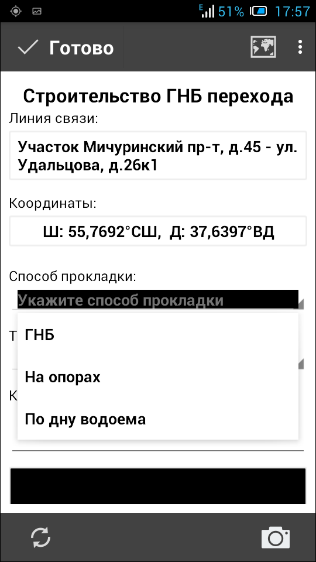

.. sectionauthor:: Александр Мурый <amuriy@gmail.com>

.. _compulink_mobile_works_type:

Вид работ
===============

В главном окне приложения после завершения начальной синхронизации пользователю предлагается выбрать вид работ (список стандартизирован) (:numref:`work_types`):

* Прокладка кабеля  
* Разварка муфты
* Разварка кросса
* Монтаж точки доступа
* Строительство ГНБ перехода 

.. figure:: _static/work_types.png
   :name: work_types
   :align: center
   :height: 10cm
   
   Вид работ
  
Дальнейшая работа приложения зависит от выбранного вида работ.

Прокладка кабеля
----------

Вид работ "Прокладка кабеля" (:numref:`cabel`) имеет один задаваемый параметр - "Способ прокладки", а также стандартный набор инструментов (комментарий, фотографии). 

.. figure:: _static/cabel.png
   :name: cabel
   :align: center
   :height: 10cm

   Прокладка кабеля.

текст

(:numref:`cabel_comment`)

.. figure:: _static/cabel_comment.png
   :name: cabel_comment
   :align: center
   :height: 10cm

   Ввод комментария

текст

(:numref:`cabel_method`)   

   Выбор способа прокладки

(:numref:`cancel_confirm`)   

текст

.. figure:: _static/cancel_confirm.png
   :name: cancel_confirm
   :align: center
   :height: 10cm

   Отмена ввода данных

(:numref:`coords_error`)

текст

.. figure:: _static/coords_error.png
   :name: coords_error
   :align: center
   :height: 10cm

   Ошибка определения координат

текст

|
|
|
|
|
|

Разварка муфты
----------

Вид работ "Разварка муфты" (:numref:`razvarka_mufty_0`) имеет два задаваемых параметра: "Тип муфты" и "Место размещения муфты", а также стандартный набор инструментов (комментарий, фотографии).

   Разварка муфты

текст   

(:numref:`razvarka_mufty_1`)   

.. figure:: _static/razvarka_mufty_1.png
   :name: razvarka_mufty_1
   :align: center
   :height: 10cm

   Выбор типа муфты

текст

(:numref:`razvarka_mufty_2`)

Выбор места размещения муфты

текст

|
|
|
|

Разварка кросса
----------

Вид работ "Разварка кросса" (:numref:`razvarka_krossa`) не имеет специализированных параметров, только стандартный набор инструментов (комментарий, фотографии).

.. figure:: _static/razvarka_krossa.png
   :name: razvarka_krossa
   :align: center
   :height: 10cm

   Разварка кросса

текст

|
|
|
|
|

Монтаж точки доступа
----------

Вид работ "Монтаж точки доступа" (:numref:`montage_point`) не имеет специализированных параметров, только стандартный набор инструментов (комментарий, фотографии).

.. figure:: _static/montage_point.png
   :name: montage_point
   :align: center
   :height: 10cm

   Монтаж точки доступа

текст

|
|
|
|
|

Строительство ГНБ перехода
----------

Вид работ "Строительство ГНБ перехода" (:numref:`GNB_perehod_0`) имеет два задаваемых параметра: "Способ прокладки" и "Точка входа/выхода", а также стандартный набор инструментов (комментарий, фотографии).

.. figure:: _static/GNB_perehod_0.png
   :name: GNB_perehod_0
   :align: center
   :height: 10cm

   Строительство ГНБ перехода

(:numref:`GNB_perehod_1`)

текст

   Способ прокладки

(:numref:`GNB_perehod_2`)

текст

   Точка входа/выхода

текст

