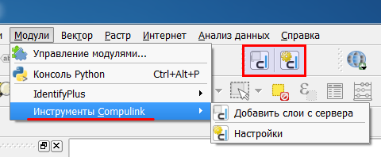
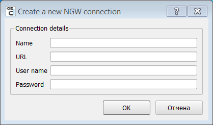
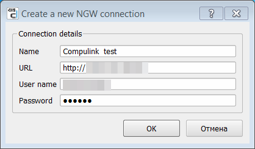
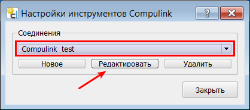
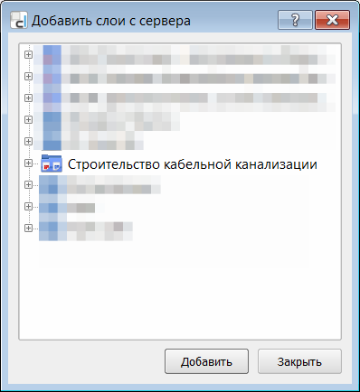
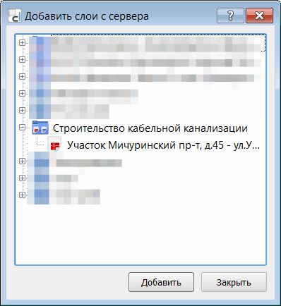
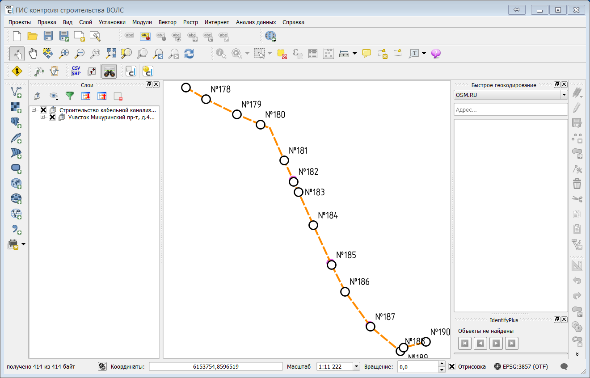

.. sectionauthor:: Александр Мурый <amuriy@gmail.com>   

.. _compulink_tools:
    
Инструменты Compulink
======================

Модуль расширения **"Инструменты Compulink"** устанавливается по умолчанию при установке системы. Модуль служит для подключения к серверу с данными строительства ВОЛС.

Модуль включает две кнопки:

* Добавить слои с сервера
* Настройки

Запустить модуль можно двумя способами: либо через меню *Модули --> Инструменты Compulink*, либо нажатием на соответствующие кнопки на панели инструментов в верхней части окна. 

   
   Модуль расширения "Инструменты Compulink".

Настройка
~~~~~~~~~~~~~~~~~~~~

При первом запуске модуля необходимо запустить инструмент **"Настройки"** нажатием на нужную кнопку или из меню. 
   

   "Инструменты Compulink", настройка

Для установки нового подключения к серверу данных в появившемся окне нужно нажать на кнопку **Новое**. Появится окно, в котором нужно будет задать несколько параметров (в текущей версии ГИС на англ. языке):

* **Name** -- название подлючения
* **URL** -- полная ссылка на действующий сервер данных
* **User name** -- имя пользователя
* **Password** -- пароль

   "Инструменты Compulink", установка нового соединения

Пример заполнения параметров можно увидеть здесь:

После заполнения параметров и нажатия на кнопку ОК появится окно инструментов Compulink, в графе "Соединения" отобразится только что созданное соединение.

Модуль позволяет устанавливать любое количество соединений. При наличии нескольких соединений можно выбрать нужное из выпадающего списка.

При необходимости соединение можно редактировать или удалить, для чего служит соответствующие кнопки.

Добавление слоев с сервера
~~~~~~~~~~~~~~~~~~~~~~~~~~~~~~

После настройки подключения необходимо нажать на кнопку **Добавить слои с сервера**, после чего появится окно со списком доступных слоев (:numref:`compulink_tools_add`).

   Добавление слоев с сервера

При нажатии на крестик слева напротив имени ресурса откроется список конкретных участков строительства ВОЛС (:numref:`compulink_tools_add2`).

   Список участков строительства ВОЛС
		   

Для подключения участка необхожимо выбрать его из списка и нажать кнопку **Добавить**. После этого пойдет загрузка слоев, могут появляться и исчезать отдельные окна, показывающие процесс загрузки. 

В результате в списке слоев окна ГИС должны появится группа слоев с данными из выбранного участка строительства ВОЛС. Слои имеют настроенные (стандартные) условные знаки (:numref:`work1`).
		   

   Участок строительства ВОЛС в списке слоев

Если нажать на кнопку **Развернуть все** на панели слоев сверху, то можно увидеть полное дерево слоев с условными обозначениями.		   
При необходимости можно подключить карту-"подоснову", используя плагин QuickMapServices. Подробное описание работы плагина находится здесь: :ref:`QuickMapServices`.
