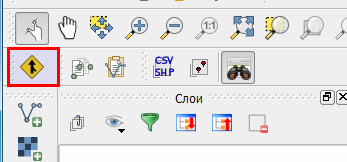
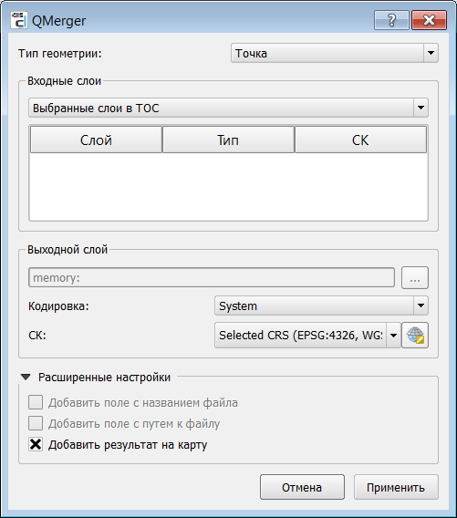
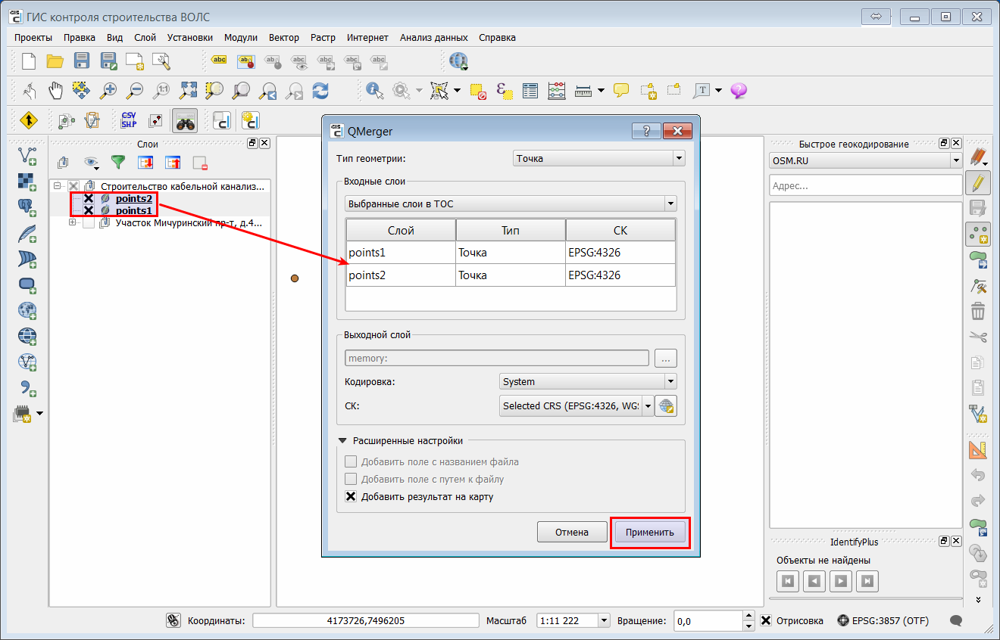
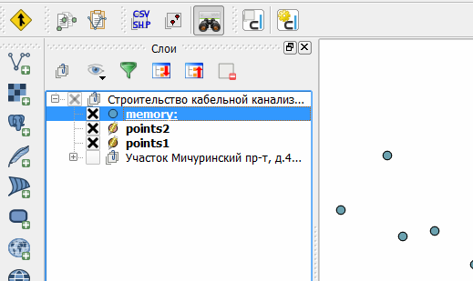

.. sectionauthor:: Александр Мурый <amuriy@gmail.com> 

.. _qmerger:
    
Модуль расширения QMerger
==============================

Модуль расширения **QMerger** предназначен для послойного объединения векторных данных разной геометрии в единый слой.

Модуль устанавливается по умолчанию при установке системы и представлен одной кнопкой (:numref:`qmerger`).

   Модуль расширения **QMerger** 
		   
При нажатии на кнопку модуля появляется окно с параметрами (:numref:`qmerger2`):

* Тип геометрии
* Входные слои
* Выходной слой
* Расширенные настройки
		   

   Модуль расширения **QMerger**, параметры 

Необходимо сначала выбрать тип геометрии (точка, линия, полигон), который соответствует исходным данным.

Графа **Входные слои** содержит всплывающее меню с пунктами "Выбранные слои в TOC", "Из директории", "Выбранные файлы". По умолчанию используется первый пункт.

**Выходной слой** в текущей версии модуля задан автоматически -- это слой типа "memory", т.е. временный слой приложения, хранящийся в оперативной памяти компьютера. Для выходного слоя можно задать только кодировку и систему координат.

**Расширенные настройки** в текущей версии модуля включают один активный параметр -- "Добавить результат на карту" (включен по умолчанию).

Порядок работы с модулем следующий:

* Выбрать в списке слоев (TOC) в левой панели окна ГИС нужные слои (с нажатой клавишей *Shift* или *Ctrl*) (:numref:`qmerger3`).
* Перейти в окно модуля. Выбранные ранее слои с их свойствами должны отобразиться в окне под строкой "Выбранные слои в TOC".    
* Нажать кнопку **Применить** в нижнем правом углу окна модуля.

   Модуль расширения **QMerger**, объединение слоев

Новый слой *"memory:"* должен появиться в списке слоев (:numref:`qmerger4`).
		   

   
   Модуль расширения **QMerger**, выходной слой

