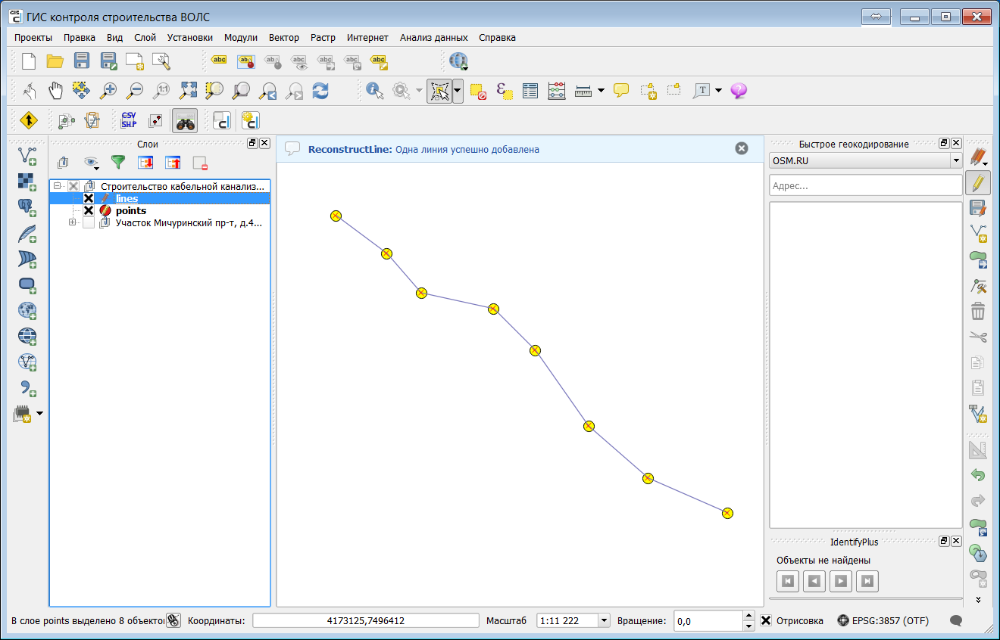

.. sectionauthor:: Александр Мурый <amuriy@gmail.com> 

.. _reconstructLine:
    
Модуль расширения ReconstructLine
==================================

**ReconstructLine** -- это инструмент для интерактивного создания линейных объектов по точечным данным.

Модуль доступен по умолчанию после установки ГИС Компьюлинк и представлен двумя кнопками на панели инструментов: **"копировать точки"** и **"вставить линию"**.

Модуль ReconstructLine умеет восстанавливать линии по точкам, используя только их пространственное расположение. Модуль может работать в двух режимах, "восстанавливая" единую линию или несколько линий. Поскольку восстановление - это сложный алгоритм, ReconstructLine работает только интерактивно. Процесс восстановления может занять значительное время, если точек много.

Реальный пример применения - если есть несколько треков снятых в разное время, возможно разными людьми и представляющих один и тот же линейный объект. Их все необходимо объединить в единый объект. Подобная задача часто возникает при строительстве ВОЛС.

Порядок работы с модулем:

1. Инструментом выделения выделите нужные точки, нажмите на кнопку **"Копировать точки"** на панели инструментов ReconstructLine.

   
2. Вставьте линию в линейный слой (если слоя нет - создайте новый или добавьте существующий). Выберите слой в списке слоёв, начните редактирование и нажмите на кнопку **"Вставить линию"** на панели инструментов ReconstructLine.

   

В результате в линейном слое должна появиться новая линия, соединяющая выбранные точки.

При необходимости процесс можно повторять до достижения нужного эффекта. 
