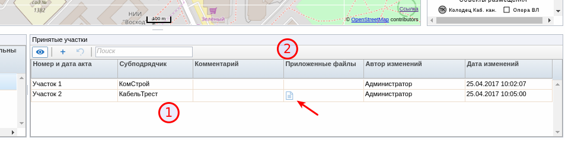
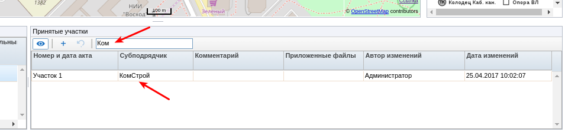
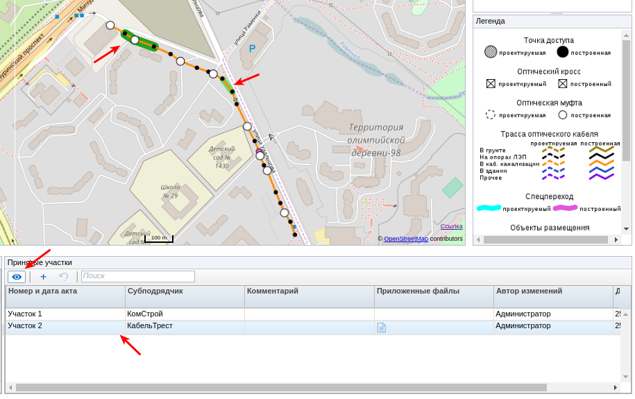
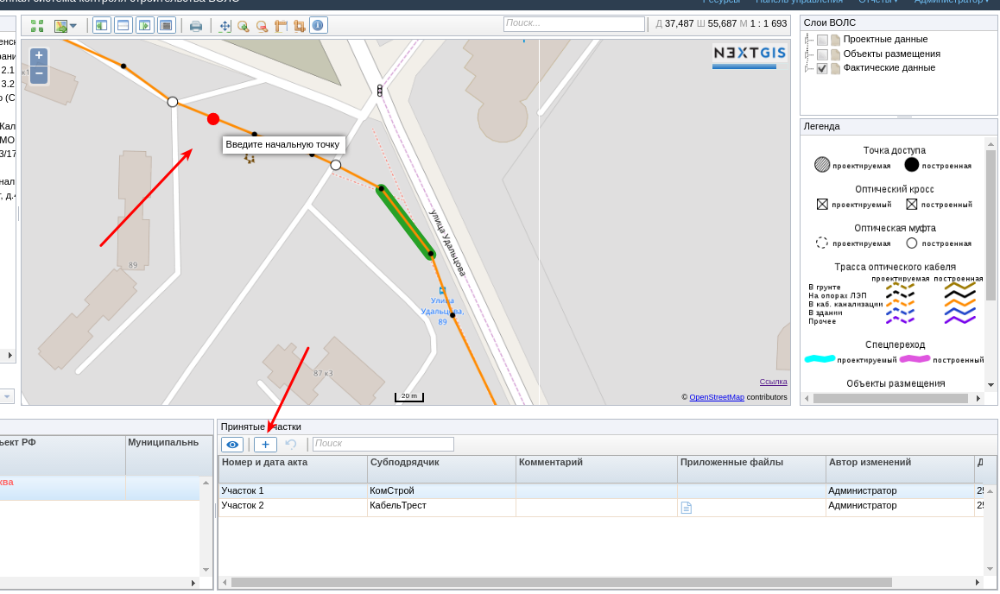
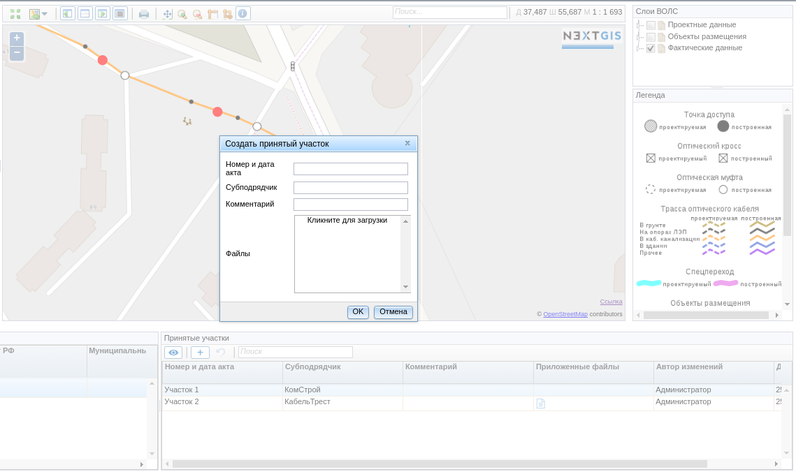
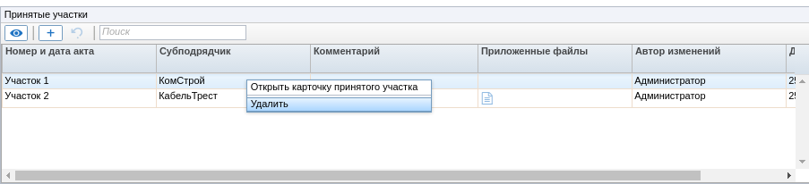

.. sectionauthor:: Александр Мурый <amuriy@gmail.com>

.. _compulink_web_accepted_region_:

Панель работы с принятыми участками
===================================

Веб-приложение позволяет работать с принятыми участками объектов строительства. Для начала работы с принятыми участками необходимо в дереве объектов строительства необходимо отметить нужную линию связи, а затем выбрать её в таблице обеъектов (снизу слева).

   Панель "Принятые участки"

Панель содержит слудующие элементы:

1. Таблицу принятых участков
2. Панель инструментов

При выборе объекта строительства в таблице отображаются уже введеные участки. Для каждого участка могут быть указаны поля:

* Номер и дата акта (в виде строки)
* Субподрядчик строительства
* Комментарий к участку
* Приложенные файлы
* Автор изменений (последний пользователь, сделавший изменения)
* Дата изменений

Если участок имет приложенные файлы (например копию акта), то в таблице в соответствующем столбце будет отображаться пиктограмма. Для получения файла необходимо кликнуть по пиктограмме.

Панель инструментов содержит следующие инструменты:

* Включение\выключение отображения участков на карте
* Добавление нового принятого участка
* Отмена ввода нового участка
* Поле поиска по принятым участкам

При вводе текста в поле поиска таблица будет содержить только подходящие принятые участки (:numref:`ar_panel_2`).

   Поиск участка

При включении кнопки отображения принятых участков на карте, для выбранного объекта строительства будут отображены введеные участки (:numref:`ar_panel_3`). Принятые участки отображаются широкой зеленой линией. Выбранный в таблице участок отображается темно-зеленой линией. Двойной щелчек по принятому участку в таблице приведет к его выбору и центрированию карты для выбранного элемента.

   Принятые участки на карте

Вввод нового участка осуществляется путем его указания на карте и вводом атрибутивной информации. Для начала ввода нового участка необходимо нажать кнопку "Отметить принятый участок" на панели инструментов. После этого карта переходит в режим ввода отметок начала и конца участка ((:numref:`ar_panel_4`). Точки начала и окончания участка можно указывать только на линии ВОЛС.

   Ввод нового принятого участка

После того, как отмечены обе точки, на экране будет отображена форма ввода параметров нового принятого участка. Можно заполнить как атрибутивную информацию, так и приложить необходимые файлы (:numref:`ar_panel_5`).

   Ввод атрибутивной информации нового принятого участка

Ввод участка заканчивается нажатием на кнопку "ОК". Если участок решено не сохранять, то следует нажать кнопку "Отмена".

Таблица принятых участков так же позволяет удалять и редактировать уже созданные участки. При нажатии правой кнопкой мыши по участку появляется меню, в котором можно выбрать необходимое действие (:numref:`ar_panel_6`). Форма редактирования участка аналогична форме ввода.

   Контекстное меню таблицы принятых участков

   
	
   

   

   
