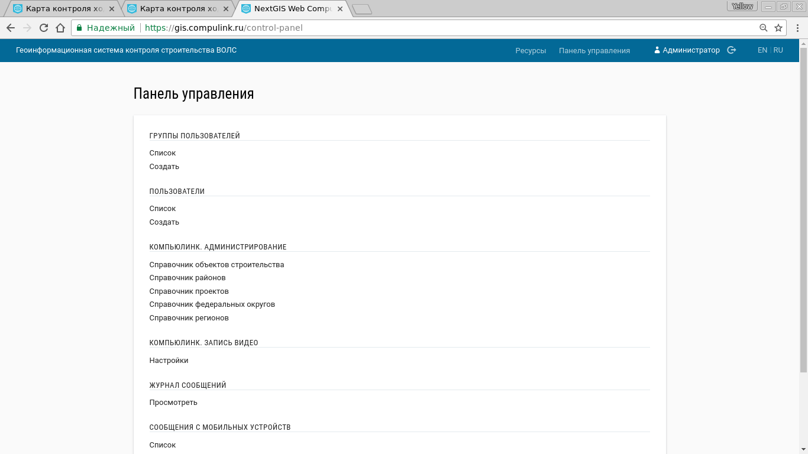

.. sectionauthor:: Александр Мурый <amuriy@gmail.com>

.. _compulink_web_control_panel:

Панель управления
====================

Панель управления (:numref:`control_panel`): является частью административного интерфейса и имеет следующие функции:

* Просмотр и создание групп пользователей
* Просмотр и создание пользователей
* Компьюлинк администрирование -- справочник объектов строительства и справочник районов
* Журнал сообщений
* Сообщения с мобильных устройств
* Системная информация  

   Панель управления

   

