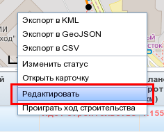
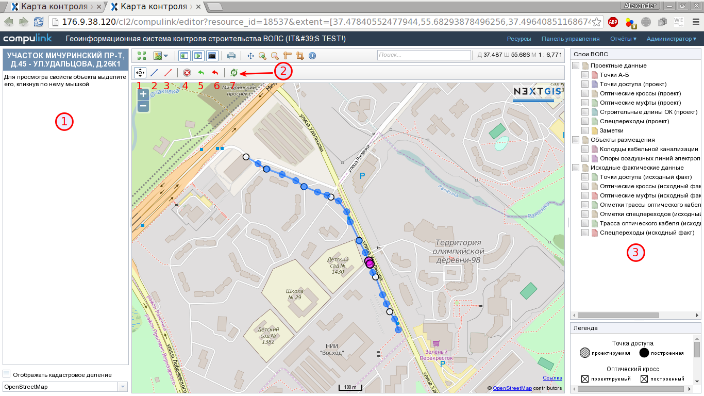
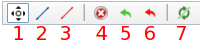
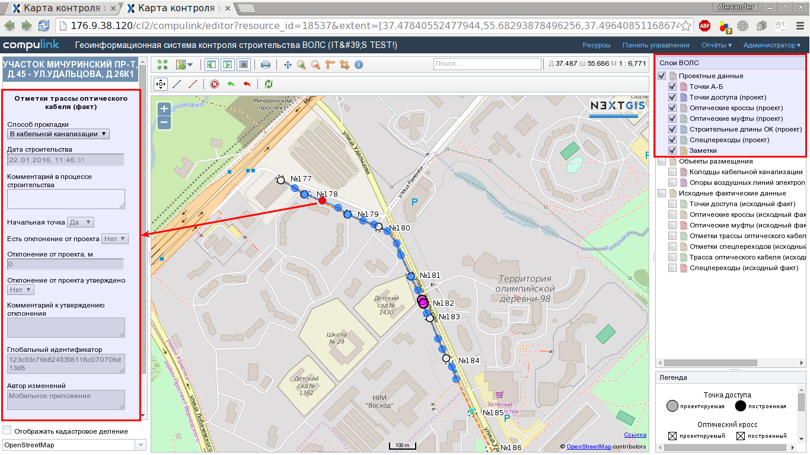
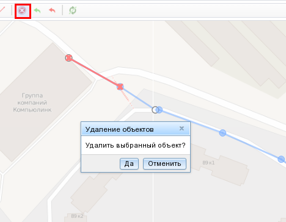

.. sectionauthor:: Александр Мурый <amuriy@gmail.com>

.. _compulink_web_editor:

Редактор
====================

Веб-приложение позволяет производить редактирование слоев с актуальными данными о строительстве (исходные фактические данные). Для начала редактирования нужно выбрать объект строительства в главном окне ГИС (:ref:`compulink_web_main_window`), затем нажатием правой кнопкой мыши вызвать меню в таблице объектов в окне карты (:ref:`compulink_web_table`) (:numref:`edit`).

   Включение редактирования в таблице объектов   

При запуске редактирования откроется новая вкладка браузера, на которой будут отображены отметки и участки трассы ВОЛС, оптические муфты и кроссы, расположение точек доступа (:numref:`edit_window`).

   Окно редактора

Также в верхней левой части окна карты под инструментами общего назначения появится панель редактирования (:numref:`edit_window_2`). 

   Инструменты редактирования

Панель редактирования включает следующие инструменты (отмечены цифрами на рисунке выше):
	
1. Выбрать и переместить
2. Создать трассу кабеля
3. Создать спецпереход
4. Удалить выбранный объект
5. Отменить изменения выбранного объекта
6. Отменить изменения всех объектов
7. Запустить автоматическое построение трассы кабеля

Пользователь может изменить положение перечисленных объектов и их атрибуты. Для этого сперва нужно выбрать редактируемый объект в окне карты с помощью инструмента **Выбрать и переместить**.

При щелчке по какому-либо объекту на карте (например, по трассе оптического кабеля, по отметкам трассы или по точке оптической муфты) объект выделится красным цветом, а в левой части окна откроется таблица атрибутов выбранного объекта (:numref:`edit_window_3`). 

   Выбор объекта редактирования на карте и изменение его атрибутов
   
Пользователь может при необходимости изменить атрибуты объекта, а затем сохранить изменения, нажав на кнопку **"Сохранить атрибуты"**.

Редактирование положения объектов на карте происходит путем перетаскивания выбранных линий (трасс) или точек при нажатой левой кнопке мыши. При отпускании кнопки мыши объект изменит свое положение, изменения будут автоматически записаны в базу данных.

Специализированные инструменты **"Создать трассу кабеля"** и **"Создать спецпереход"** служат для создания трасс кабелей и спецпереходов по точкам объектов. После нажатия на кнопку инструмента курсок мыши изменится на крест; далее нужно последовательно щелкнуть на карте по двум существующим точечным объектам - запустится процесс создания трассы. Новая линия трассы появится на карте.

Пользователь имеет возможность удалить выбранные объекты в различных слоях. Для этого сначала нужно выбрать объекты, затем нажать на кнопку **Удалить выбранный объект** и подтвердить удаление (:numref:`edit_window_del`):

Редактор позволяет отменить все правки как для выделенного объекта в слое, так и всего объекта строительства.

.. note:: Нужно быть осторожным с отменой всех правок - это удалит все правки всех пользователей для данного объекта строительства.
		  
При необходимости пользователь имеет возможность запустить процедуру полного автоматического перестроения геометрии линии (крайняя правая кнопка на панели редактирования).

Все изменения сохраняются в редакторе автоматически. Выход из редактора осуществляется закрытием текущей вкладки веб-браузера.

   
	
   

   

   
