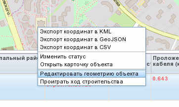

.. sectionauthor:: Александр Мурый <amuriy@gmail.com>

.. _compulink_web_editor:

Редактор
====================

   Включение редактирования в таблице объектов

|
|

.. figure:: _static/compulink/edit_window.png
   :name: edit_window
   :align: center
   :width: 15cm

   Окно редактора

.. figure:: _static/compulink/edit_window_2.png
   :name: edit_window_2
   :align: center
   :width: 7cm

    Инструменты редактирования

1. Выбрать и переместить
2. Создать трассу кабеля
3. Создать спецпереход
4. Удалить выбранный объект
5. Отменить изменения выбранного объекта
6. Отменить изменения всех объектов
7. Запустить автоматическое построение трассы кабеля

   
	
   

    Выбор объекта редактирования на карте и изменение его атрибутов

   

   
