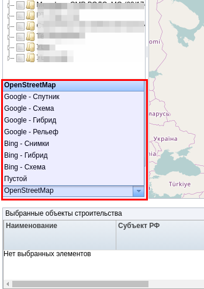
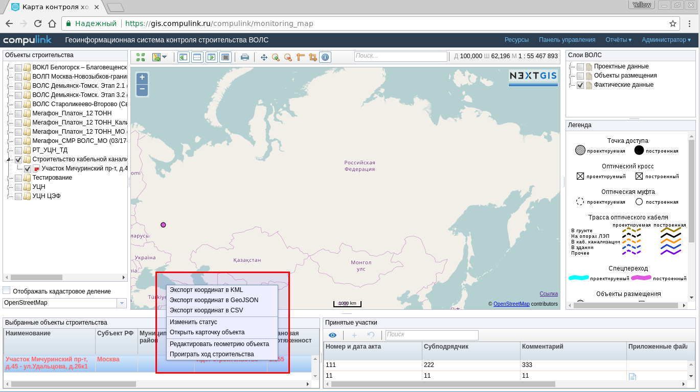

.. sectionauthor:: Александр Мурый <amuriy@gmail.com>

.. _compulink_web_main_window:

Интерфейс NextGIS Web Compulink
==================================

Главное окно
--------------------

.. figure:: _static/compulink/main_window.png
   :name: main_window
   :align: center
   :width: 20cm

   Главное окно NextGIS Web Compulink

   Выбор участка строительства и отображение его в окне карты
   

Дерево проектов и объектов
~~~~~~~~~~~~~~~~~~~~~~~~~~~~~~

   Дерево проектов и объектов строительства

|
|

   

   Подключаемые картографические подложки

Перечень подключаемых картографических подложек:

* OpenStreetMap;
* Google – Спутник;
* Google – Схема;
* Google – Гибрид;
* Google –  Рельеф;
* Bing – Снимки;
* Bing – Гибрид;
* Bing – Схема;
* Пустой.

   
|
|
|

Окно карты
~~~~~~~~~~~~~~~

.. figure:: _static/compulink/map_window_map1.png
   :name: map_window_map1
   :align: center
   :width: 20cm

    Отображение данных ВОЛС на участке строительства в окне карты

.. figure:: _static/compulink/map_window_top.png
   :name: main_window_top
   :align: center
   :width: 15cm

   Инструменты окна карты

.. figure:: _static/compulink/map_window_coords_enter.png
   :name: map_window_coords_enter
   :align: center
   :width: 15cm

   Ввод координат "вручную"
   

   Печать карты

.. figure:: _static/compulink/map_window_measure1.png
   :name: map_window_measure1
   :align: center
   :width: 15cm

   Измерение длины линий в окне карты

.. figure:: _static/compulink/map_window_measure2.png
   :name: map_window_measure2
   :align: center
   :width: 15cm

   Измерение площади полигонов в окне карты

.. figure:: _static/compulink/map_window_info.png
   :name: map_window_info
   :align: center
   :width: 15cm

   Инструмент идентификации объектов в окне карты

.. figure:: _static/compulink/map_window_info_photo.png
   :name: map_window_info_photo
   :align: center
   :width: 15cm

   Прикрепленная фотография в атрибутах объекта 
   
|
|
|
   

Таблица объектов
~~~~~~~~~~~~~~~~~~~~

.. figure:: _static/compulink/table_objects.png
   :name: table_objects
   :align: center
   :width: 15cm

   Таблица объектов

   Меню таблицы объектов

   
   

Слои ВОЛС
~~~~~~~~~~~~~~~~~~~~

   Слои ВОЛС в главном окне

|
|
|

Легенда
~~~~~~~~~~~~~~~

.. figure:: _static/compulink/legend.png
   :name: legend
   :align: center
   :width: 15cm

   Условные обозначения (легенда карты)
