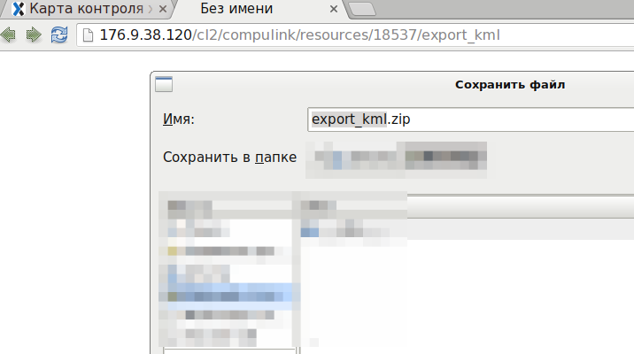
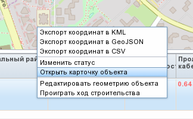
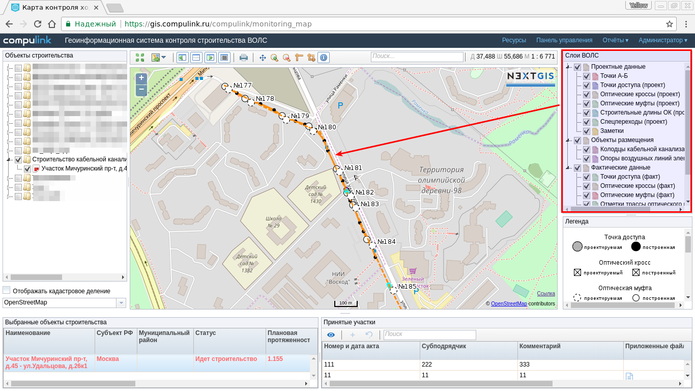

.. sectionauthor:: Александр Мурый <amuriy@gmail.com>

.. _compulink_web_main_window:

Интерфейс веб-приложения
==================================

Главное окно
--------------------

Интерфейс главного окна веб-приложения разделен на несколько основных частей (отмечены цифрами на :numref:`main_window`):

1. Дерево проектов и объектов
2. Окно карты (с таблицей объектов)
3. Слои ВОЛС
4. Легенда (условные обозначения)
5. Панель ресурсов, управления и отчетов

.. figure:: _static/compulink/main_window.png
   :name: main_window
   :align: center
   :width: 15.8cm

   Главное окно NextGIS Web Compulink

Список проектов и объектов
~~~~~~~~~~~~~~~~~~~~~~~~~~~~~~

В левой части главного окна находится древовидный список проектов и объектов строительства, доступных текущему пользователю. 

.. figure:: _static/compulink/main_window_toc.png
   :name: main_window_toc
   :align: center
   :width: 7cm

   Дерево проектов и объектов строительства

В нижней части дерева проектов и объектов располагается меню выбора картографических подложек, отображаемых в окне карты.

Перечень подключаемых картографических подложек:

* OpenStreetMap;
* Google – Спутник;
* Google – Схема;
* Google – Гибрид;
* Google –  Рельеф;
* Bing – Снимки;
* Bing – Гибрид;
* Bing – Схема;
* Пустой.

.. figure:: _static/compulink/basemaps.png
   :name: basemaps
   :align: center
   :width: 7cm

   Подключаемые картографические подложки

По умолчанию используется подложка OpenStreetMap.
   

Окно карты
~~~~~~~~~~~~~~~

Окно карты располагается по центру главного окна веб-приложения.
После запуска веб-приложения в окне отображается мелкомасштабная обзорная карта России и сопредельных государств (подложка OpenStreetMap). При укрупнении масштаба (приближении) детальность отображаемой подложки увеличивается.

При активизации в дереве проектов и объектов какого-либо объекта его данные появляются на карте в виде набора точек и линий, а атрибутивная информация появляется в таблице объектов в нижней части окна карты (:numref:`map_window_map1`).

.. figure:: _static/compulink/main_window_2.png
   :name: main_window_2
   :align: center
   :width: 15.8cm

   Выбор участка строительства и отображение его в окне карты
   

В левой верхней части окна карты находится панель инструментов общего назначения (на :numref:`map_window_top` показаны цифрами):

1. Показать всё
2. Перейти к координатам
3. Скрыть/показать левую панель
4. Скрыть/показать нижнюю панель
5. Скрыть/показать правую панель
6. Скрыть/показать легенду   
7. Печать
8. Перемещение
9. Увеличение (Zoom in)
10. Уменьшение (Zoom out)
11. Измерение расстояний (Measure distance)
12. Измерение площади (Measure area)
13. Информация об объекте
14. Поиск
15. Координаты центра окна и текущий масштаб
	

   
.. figure:: _static/compulink/map_window_top.png
   :name: map_window_top
   :align: center
   :width: 15.8cm

   Инструменты окна карты

Для бестрого перехода к координатам необходимо ввести нужные координаты (широта/долгота) в специальное всплывающее окно (:numref:`map_window_coords_enter`). 
   

.. figure:: _static/compulink/map_window_coords_enter.png
   :name: map_window_coords_enter
   :align: center
   :width: 7cm

   Перейти к координатам
   
Для печати карты с отображенными объектами строительства необходимо нажать на кнопку **"Печать"**. Появится отдельное окно с предпросмотром печати. В окне можно выбрать размер бумаги (стандартные размеры - A4, A3 и т.п.) при печати.

.. figure:: _static/compulink/map_window_print.png
   :name: map_window_print
   :align: center
   :width: 15.8cm

   Печать карты

В веб-приложении есть возможность измерять длины и площади в окне карты. Для запуска этих инструментов служат специальные кнопки (см. :numref:`map_window_measure1` и (:numref:`map_window_measure2`).   

.. figure:: _static/compulink/map_window_measure1.png
   :name: map_window_measure1
   :align: center
   :width: 13cm

   Измерение длины линий в окне карты

.. figure:: _static/compulink/map_window_measure2.png
   :name: map_window_measure2
   :align: center
   :width: 13cm

   Измерение площади полигонов в окне карты

Инструмент идентификации объектов (:numref:`map_window_info`) в окне карты позволяет получить полную информацию об объекте включая дату создания, атрибутивные данные, а также прикрепленные фотографии (:numref:`map_window_info_photo`).
   

   Инструмент идентификации объектов в окне карты

   Прикрепленная фотография в атрибутах объекта 
   

.. _compulink_web_table:

Таблица объектов
~~~~~~~~~~~~~~~~~~~~

В нижней части окна карты находится таблица объектов. В ней отображаются свойства (атрибуты) объектов, выбранных в списке слоев. Атрибуты показывают оперативные данные и в табличной форме отражают текущее состояние строительства. В текущей версии веб-приложения доступны следующие атрибуты (:numref:`table_objects`):

* Наименование
* Субъект РФ
* Муниципальный район
* Статус
* Плановая протяженность (км)
* Проложено кабеля (км)
* % выполнения
* Начало СМР
* Окончание СМР
* Начало сдачи заказчику
* Окончание сдачи заказчику
* Субподрядчик

   Таблица объектов

При нажатии по таблице объектов правой кнопкой мыши открывается меню, содержащее несколько действий (:numref:`map_window_attr`):

* Экспорт в форматы KML, GeoJSON, CSV
* Изменить статус
* Открыть карточку
* Редактировать
* Проиграть ход строительства

   
.. figure:: _static/compulink/map_window_attr.png
   :name: map_window_attr
   :align: center
   :width: 15.8cm

   Меню таблицы объектов

Веб-приложение позволяет экспортировать пространственные и атрибутивные данные строительства в широко распространенные форматы геоданных: KML, GeoJSON, CSV. При нажатии на соответствующий пункт меню откроется новое окно (вкладка браузера) и появится диалог сохранения файла (:numref:`export_kml`):   

   Экспорт в KML

   
При нажатии на пункт меню **"Изменить статус"** (:numref:`change_status`) появится всплывающее окно, в котором можно будет изменить статус строительства (:numref:`change_status_2`).

   Пункт меню **"Изменить статус"**

   Смена статуса строительства

При нажатии на пункт меню **"Открыть карточку"** (:numref:`open_card`) появится всплывающее окно, в котором можно будет изменить атрибутивную информацию об объекте строительства (:numref:`open_card_2`).

   Пункт меню **"Открыть карточку"**

   Карточка объекта 

В таких графах как **"Начало СМР"** и подобных при задании даты появляется всплывающее окно с календарем (:numref:`open_card_3`).

   Настройка даты

При выборе местоположения объекта появляется всплывающий список регионов и входящих в них районов (:numref:`open_card_4`).

   Выбор местоположения
   

Слои ВОЛС
~~~~~~~~~~~~~~~~~~~~

В правой верхней части главного окна веб-приложения находится переключатель слоев ВОЛС -- **"Слои ВОЛС"** (:numref:`map_window_map1`). Слои разбиты на 3 группы по своему происхождению и характеру данных:

* Проектные данные 
* Объекты размещения
* Фактические данные

Пользователь может активизировать как группу слоев целиком, так и отдельные слои в пределах групп.
  
При необходимости можно отключать отображение слоев ВОЛС (кнопка **"Скрыть/показать правую панель"** на панели инструментов), и также изменять размер окна.

    Слои ВОЛС на данном участке строительства

..
   .. figure:: _static/compulink/layers.png
	  :name: layers
	  :align: center
	  :width: 7cm

	  Слои ВОЛС в главном окне

Легенда
~~~~~~~~~~~~~~~

Легенда карты (условные обозначения) располагается в правой нижней части главного окна веб-приложения (:numref:`legend`). При необходимости можно отключать отображение легенды (кнопка **"Скрыть/показать легенду"** на панели инструментов), а также изменять размер её окна.

.. figure:: _static/compulink/legend.png
   :name: legend
   :align: center
   :width: 7cm

   Условные обозначения (легенда карты)

Панель администрирования
~~~~~~~~~~~~~~~~~~~~~~~~~~~~~~~~~~~~~~~~

В верхней правой части главного окна располагается панель администрирования веб-приложения (:numref:`panel_1`). 

.. figure:: _static/compulink/panel_1.png
   :name: panel_1
   :align: center
   :width: 12cm

   Панель администрирования
		   
Панель имеет следующие пункты:

* Ресурсы
* Панель управление
* Отчеты
* Администратор  

Выбор любого из пунктов панели (кроме **"Администратор"**) приводит к открытию новой вкладки браузера с соответствующим содержанием. Пункт **"Администратор"** имеет только параметр **"Выход"** и служит для выхода из учетной записи текущего пользователя.

