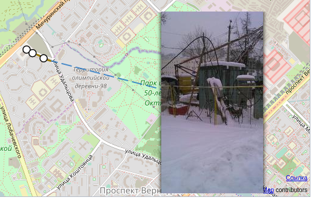
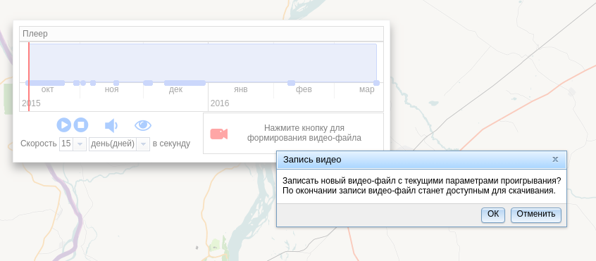
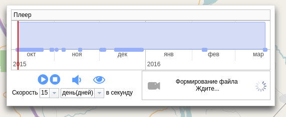
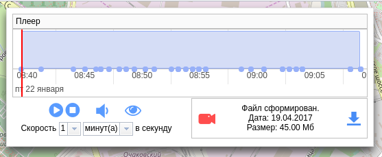

.. sectionauthor:: Александр Мурый <amuriy@gmail.com>

.. _compulink_web_pleer:

Проигрыватель хода строительства
================================

Веб-приложение позволяет визуализировать временной ход строительства. Запуск проигрывателя хода строительства производится из таблицы объектов. Щелчком правой кнопкой мыши по таблице объектов вызывается меню, из которого нужно выбрать пункт **"Проиграть ход строительства"** (:numref:`pleer_1`).

.. figure:: _static/compulink/pleer_1.png
   :name: pleer_1
   :align: center
   :width: 7cm

   Запуск проигрывателя хода строительства из таблицы объектов

В новой вкладке (или в новом окне, в зависимости от настроек веб-браузера) запустится отдельное окно карты с проигрывателем (:numref:`pleer_2`). Окно проигрывателя можно перемещать по окну карты.

.. figure:: _static/compulink/pleer_2.png
   :name: pleer_2
   :align: center
   :width: 11cm

   Окно проигрывателя хода строительства

Окно проигрывателя хода строительства имеет следующие элементы:

1. Панель управления временем
2. Кнопки управления воспроизведением
3. Настройки скорости воспроизведения
4. Включение\выключение звукового сопровождения
5. Включение\выключение отображения фото
6. Панель записи видео

В верхней части проигрывателя находится панель управления временем (с голубым фоном) с временными отметками (дата/время), соответствующих этапам строительства. В левой части панели можно видеть вертикальную красную черту, которая отвечает за ход проигрывания. Черту можно перемещать вручную в произвольном порядке, вместе с этим в окне карты будет воспроизводиться ход строительства (появляться точки и линии ВОЛС). 

Кнопки управления слева направо: Старт, Стоп. При нажатии на кнопку "Старт" (с треугольником) начинается воспроизведение с выбранного временного отрезка. После начала воспроизведения Кнопка "Старт" замещается кнопкой "Пауза", при нажатии на которую происходит приостановка воспроизведения. Нажатие на кнопку "Стоп" приводит к остановке воспроизведения и возврату к началу проигрывания.

В настройках скорости воспроизведения можно задать количество проигрываемых минут/часов/дней/месяцев в секунду.

Кнопка включения/выключения звукового сопровождения позволяет включить параллельное проигрывание звукового файла, настроенного администратором системы.

Кнопка включения/выключения фото позволяет включить параллельное отображение фото, связанных с объектами карты, отображаемых в текущий момент проигрывания (:numref:`pleer_4`).

   Отображение фото

Панели записи видео предназначена для запуска процесса формирования видео файла, а так же скачивания результирующего файла (:numref:`pleer_5`).

   Запуск процесса формирования видео файла

При нажатии на кнопку "Сформировать видео-файл" система начнет формировать видео в соответствии с текущими параметрами проигрывателя: скорость, базовая карта, охват карты, отображение  фото и воспроизведение звукового сопровождения.

В зависимости от выбранной вскорости проигрывания и продолжительности стоительства выбранного объекта запись может происходить достаточно продолжительное время (:numref:`pleer_6`).

   Отображение хода записи видео файла

По окончанию процесса записи на панели появляется информация о размере сформированного видео файла и дате его записи. Получить файл можно нажав на кнопку "Скачать" (:numref:`pleer_7`).

   Вид панели проигрывателя при готовности видео файла

Если видео файл был сформирован ранее, повторное нажатие на кнопку "Сформировать" приведет к затиранию предыдущего файла и формированию нового.

Выход из проигрывателя осуществляется закрытием текущей вкладки веб-браузера.    

