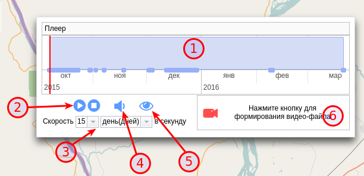

.. sectionauthor:: Александр Мурый <amuriy@gmail.com>

.. _compulink_web_pleer:

Проигрыватель хода строительства
========================================

Веб-приложение позволяет визуализировать временной ход строительства. Запуск проигрывателя хода строительства производится из таблицы объектов. Щелчком правой кнопкой мыши по таблице объектов вызывается меню, из которого нужно выбрать пункт **"Проиграть ход строительства"** (:numref:`pleer_1`).

.. figure:: _static/compulink/pleer_1.png
   :name: pleer_1
   :align: center
   :width: 7cm

   Запуск проигрывателя хода строительства из таблицы объектов

В новой вкладке (или в новом окне, в зависимости от настроек веб-браузера) запустится отдельное окно карты с проигрывателем (:numref:`pleer_2`). Окно проигрывателя можно перемещать по окну карты.

   Окно проигрывателя хода строительства из таблицы объектов

Окно проигрывателя хода строительства имеет следующие элементы:

1. Панель управления временем
2. Кнопки управления воспроизведением
3. Настройки скорости воспроизведения

В верхней части проигрывателя находится панель управления временем (с голубым фоном) с временными отметками (дата/время), соответствующих этапам строительства. В левой части панели можно видеть вертикальную красную черту, которая отвечает за ход проигрывания. Черту можно перемещать вручную в произвольном порядке, вместе с этим в окне карты будет воспроизводиться ход строительства (появляться точки и линии ВОЛС). 

Кнопки управления слева направо: переход в начало, старт, стоп, переход в конец. При нажатии на кнопку "Старт" (с треугольником) начинается воспроизведение с выбранного временного отрезка. 

В настройках скорости воспроизведения можно задать количество минут/часов в секунду.

Выход из проигрывателя осуществляется закрытием текущей вкладки веб-браузера.    

