.. sectionauthor:: Александр Мурый <amuriy@gmail.com>

.. _compulink_web_reports:

Отчеты
======

Веб-приложение предоставляет возможность построения отчетов о ходе выполнения работ и общем состоянии (:numref:`reports_1`).

Отчеты открываются в отдельных окнах в новых вкладках браузера. Запустить построение отчетов можно через специальное меню на панели администрирования (:numref:`edit_window_del`). 

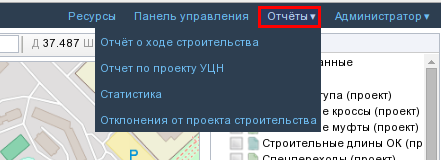

   Меню "Отчеты" на панели администрирования

В меню **"Отчеты"** представлены следующие пункты:

* Отчет о ходе строительства
* Отчет по проекту УЦН
* Статистика
* Отклонения от проекта строительства  

Отчет о ходе строительства
~~~~~~~~~~~~~~~~~~~~~~~~~~

При нажатии на пункт **"Отчет о ходе строительства"** открывается  отдельное окно (:numref:`reports_2`).

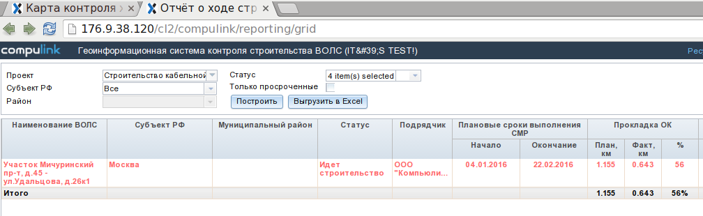

   Отчет о ходе строительства

В верхней части окна отображаются несколько пунктов выпадающего меню для выбора проекта строительства и фильтрации по нескольким параметрам.

Есть возможность выбрать проект по его названию, по субъекту РФ, по району, по статусу, а также отобразить только просроченные проекты.

После выбора соответствующих пунктов нужно нажать кнопку **"Построить"** для начала создания отчета. В нижней части окна в табличном виде отобразится информация по выбранному проекту (или нескольким проектам).

Кнопка **"Выгрузить в Excel"** позволяет выгрузить табличные данные из отчета в формат Microsoft Excel 2007 (.xlsx). Откроется новое окно (вкладка браузера) и появится диалог сохранения файла с именем типа *"status report [текущая_дата].xlsx"*

Отчет по проекту УЦН
~~~~~~~~~~~~~~~~~~~~

Веб-приложение обеспечивает возможность построения отчетов по проекту УЦН (:numref:`reports_3`). Входными параметрами для построения являются: подразделение Ростелекома и период (в годах). При построении отчетов генерируются следующие типы графиков — Динамика строительства ВОЛС, Текущее исполнение плана строительства ВОЛС, Динамика строительства точек доступа, Текущее исполнение плана строительства точек доступа. Линейные графики динамики строительства отображат помесячные суммарные значения плана строительства и фактического исполнения для выбранного подразделения.

Графики текущего исполнения — столбчатые диаграммы, отображающие отношения плана и факта для дочерних подразделений Рос-телекома относительно выбранного: МРФ, филиала, района. Период для построения графика выбирается из списка доступных годов строительства. 

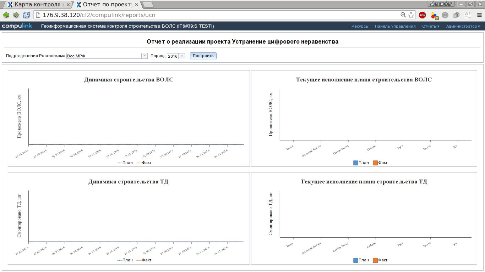

   Отчет по проекту УЦН

   
Статистика
~~~~~~~~~~

Веб-приложение позволяет получать статистику по проектам строительства (:numref:`reports_stats`). Запустить построение статистики можно через специальное меню на панели администрирования (:numref:`edit_window_del`). 

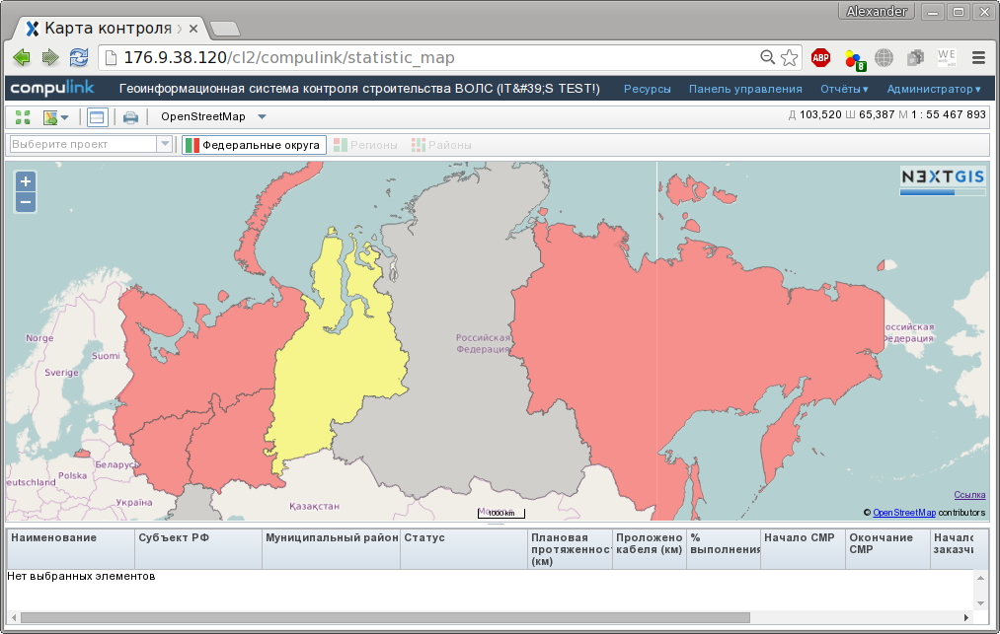

   Статистика по проекту (основное окно)

При запуске статистики появляется стандартная карта-подоснова OpenStreetMap с нанесенными границами федеральных округов РФ. Карту-подоснову можно выбрать из списка на панели инструментов в верхней части окна. Там же можно выбрать проект для вывода статистики.

Вывод статистики построен иерархически по административному принципу: вначале необходимо выбрать федеральный округ, затем на появившейся карте регионов необходимо выбрать регион, и, наконец, интересующий район (:numref:`reports_stats2`). 

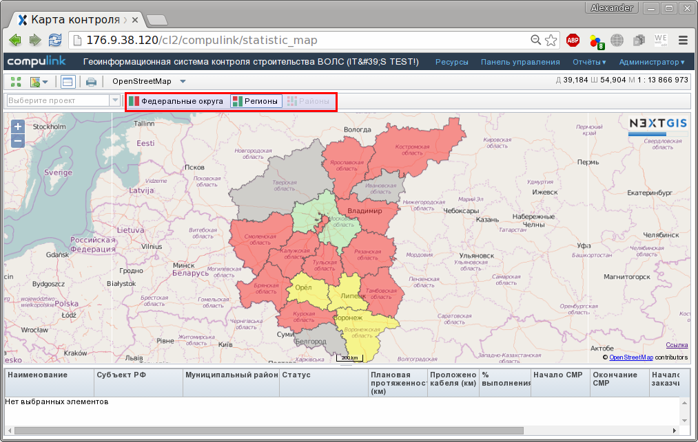

   Статистика по проекту - выбор федерального округа, региона, района

В примере (:numref:`reports_stats3`) показан тестовый участок строительства на территории г.Москва (Центральный федеральный округ). В нижней части окна карты можно видеть вывод статистики по объекту строительства: наименование, субъект РФ, статус строительства, начало/окончание работ и т.д. Кликом правой кнопкой мыши вызывается меню:

* Показать объект на карте
* Открыть карточку объекта

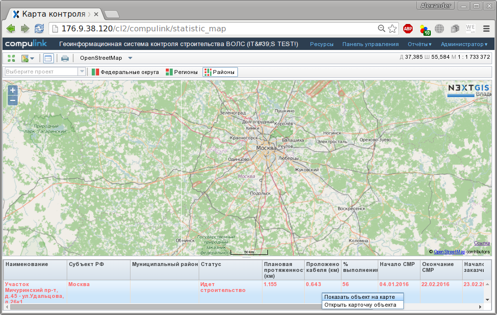

   Статистика по проекту - тестовый пример
		   
При выборе пункта **Показать объект на карте** открывается отдельное окно с подробными характеристиками данного объекта (карта, условные обозначения и т.д.). При выборе пункта **Открыть карточку объекта** появляется окно *Изменение объектов строительства* с соответствующими графами, в которых можно не только просмотреть, но и при необходимости отредактировать информацию об объектах строительства (:numref:`reports_stats4`).

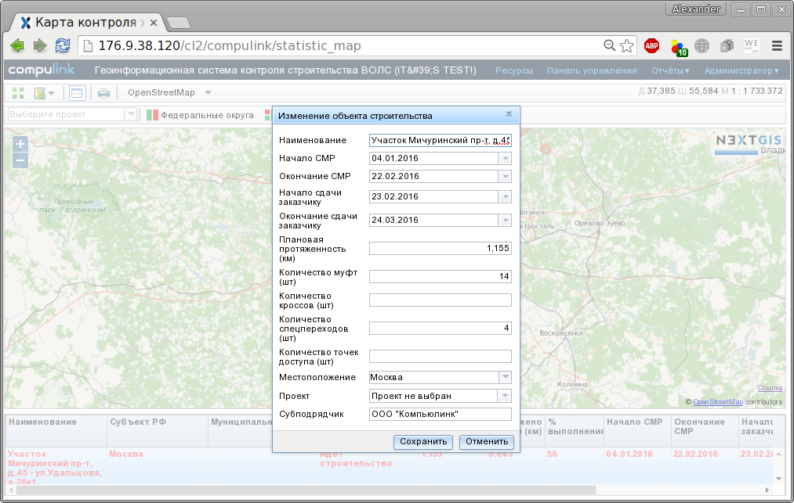

   Статистика по проекту - карточка объекта
|
|
|

Отчет по отклонениям от проекта строительства
~~~~~~~~~~~~~~~~~~~~~~~~~~~~~~~~~~~~~~~~~~~~~

Веб-приложение позволяет получать информацию по отклонениям от проектных данных строительства (:numref:`reports_deviations`).

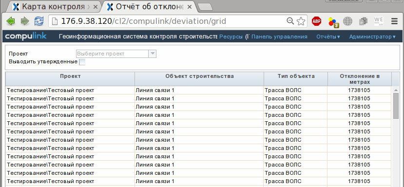

   Отклонения от проекта строительства

При настройках по умолчанию в таблице выводятся все неутвержденные отклонения от проекта строительства.
В верхней части окна присутствует выпадающее меню для выбора проекта строительства.
Выбор определенного проекта строительства приводит к выводу только тех отклонений, которые наблюдаются в этом проекте.
При активации переключателя "Выводить утвержденные" в таблице отклонений будут отражаться как утвержденные, так и неутвержденные отклонения.

При двойном клике по строке в таблице будет открыта новая вкладка с картой объекта строительства, отцентрированной по тому объекту, который имеет отклонение (:numref:`reports_deviations_2`).

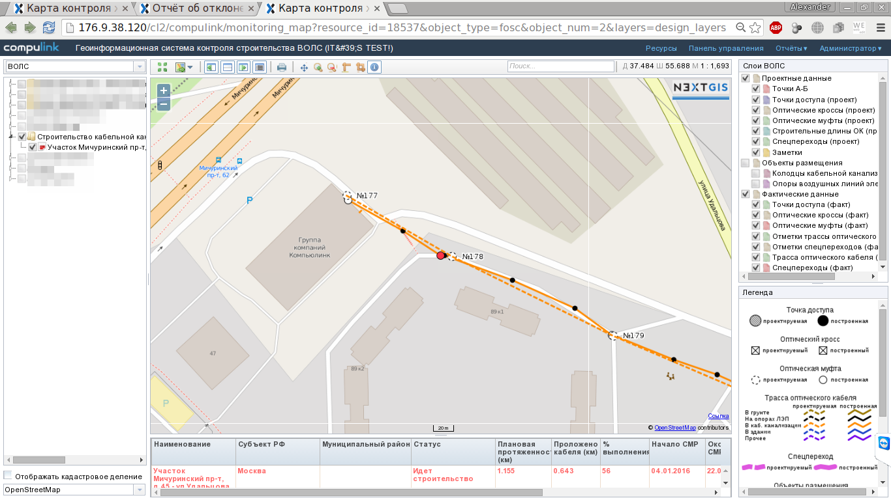

   Карта объекта строительства с неутвержденным отклонением

При правом щелчке по объекту с отклонением пользователь имеет возможность указать комментарий и утвердить данное отклонение (:numref:`reports_deviations_3`).

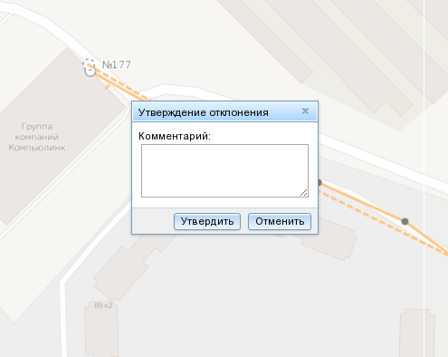

   Ввод комментария к отклонению и подтверждение отклонения

Аналогичную операцию можно выполнить для нескольких объектов с отклонениями сразу.
Для этого необходимо в таблице выбрать нужные строки и нажать кнопку "Утвердить".
В результате будет выведено окно с полем ввода комментария и кнопкой утверждения выбранных отклонений (:numref:`reports_deviations_4`).

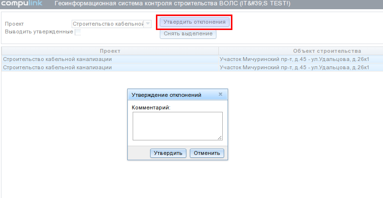

   Отклонения от проекта строительства

