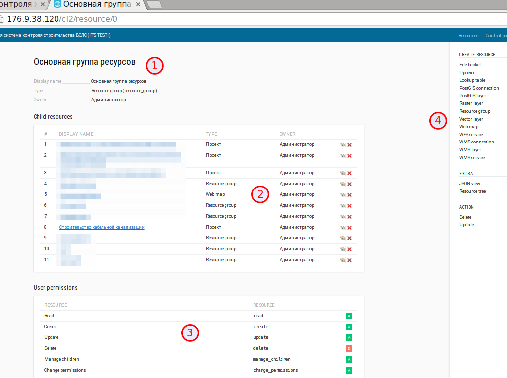
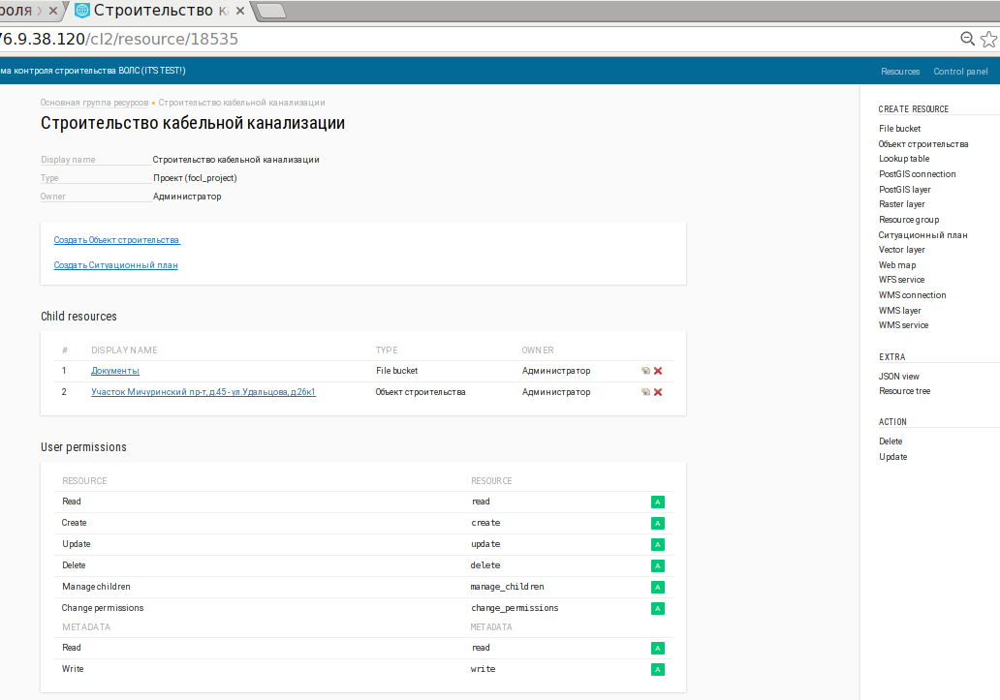
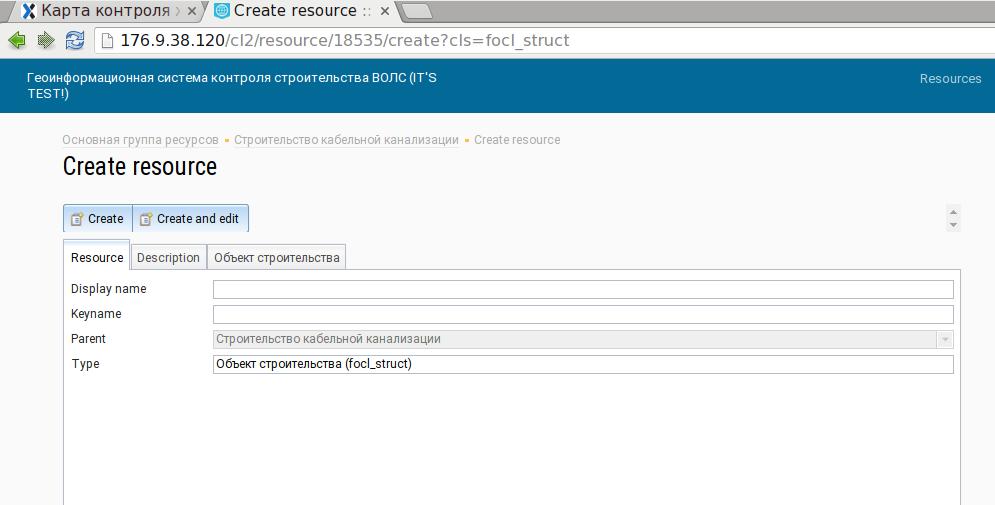

.. sectionauthor:: Александр Мурый <amuriy@gmail.com>

.. _compulink_web:

Ресурсы
==========

Для просмотра ресурсов системы нужно выбрать соответствующий пункт на верхней левой панели ресурсов, управления и отчетов.

Окно ресурсов включает следующие разделы:

1. Основная группа ресурсов
2. Дочерние ресурсы
3. Разрешения пользователей
4. Создание ресурсов

   Окно ресурсов

   Пример окна с выбранным ресурсом

   Пример создания ресурса
   
Описание работы с ресурсами представлено в Руководстве администратора.
   

