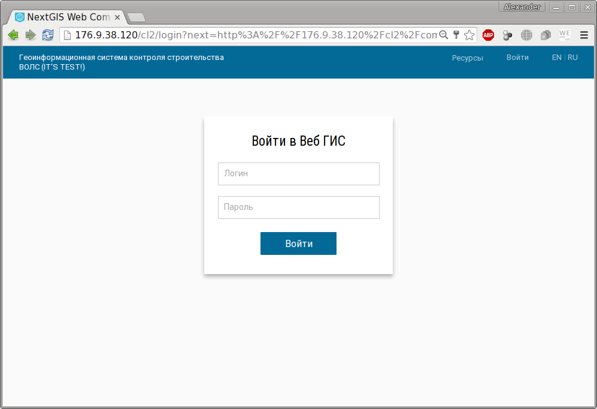

.. sectionauthor:: Александр Мурый <amuriy@gmail.com>

.. _compulink_web_start:

Начало работы
==============

Для начала работы с геоинформационной системой контроля строительства ВОЛС необходимо получить от администратора системы действительную адрес (URL) на веб-приложение, например, http://176.9.38.120/cl2/compulink/monitoring_map.

Веб-приложение работает в следующих веб-браузерах:

* Internet Explorer версии 8.0 и выше;
* Mozilla Firefox версии 31 и выше;
* Google Chrome версии 31 и выше.

При переходе по ссылке откроется окно или вкладка веб-браузера с формой для входа в систему (**Sign in to Web GIS**):

   Окно входа в систему

Пользователь должен ввести имя и пароль, полученные от администратора системы, и нажать кнопку **Sign in**.

Должно появиться основное окно геоинформационной системы, полная загрузка интерфейса может занять некоторое время.

